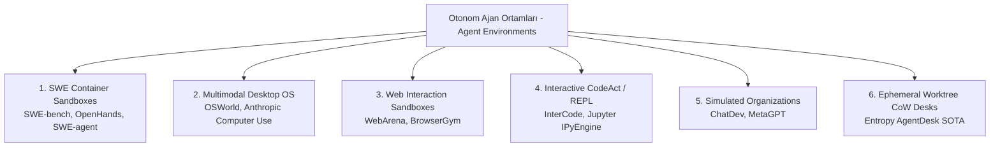
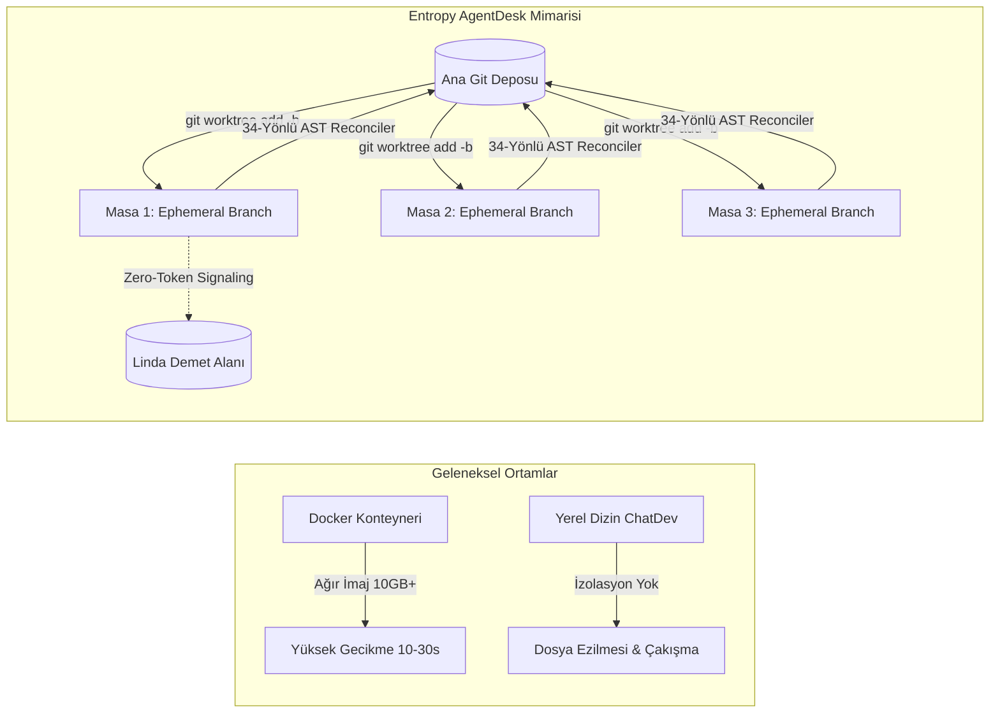

# 2026 Otonom Ajan Ortamları: Mimari Taksonomi, SOTA Kıyaslamaları ve AgentDesk Çalışma Alanı Araştırması

> [!IMPORTANT]
> Bu teknik araştırma raporu, **Entropy AI AgentDesk** çalışma alanındaki **Deep Researcher** uzmanı (Gemini 3.8 Flash High) tarafından; otonom yazılım ve işletim sistemi ajan ortamları (Autonomous Agent Environments), yürütme kum havuzları (Sandboxes), SWE-bench / OSWorld / WebArena kıyaslamaları ve **Entropy AgentDesk Ephemeral Git Worktree CoW** çalışma alanı paradigması analiz edilerek derlenmiştir.

---

## 1. Yönetici Özeti ve Temel Paradigma Değişimi: "Environment as the Primary Bottleneck"

2024–2026 döneminde otonom yapay zeka ajanlarının gelişiminde en belirleyici dönüm noktası, **"Model Zekası Darboğazı"ndan "Ortam ve İskele Darboğazı"na (Environment & Harness Bottleneck)** geçiştir.

Ham (unassisted / raw) frontier akıl yürütme modelleri (Claude 3.7 Sonnet, Gemini 3.1 Pro, OpenAI o3), izole edilmemiş veya yetersiz yapılandırılmış tekil istem-yanıt döngülerinde SWE-bench üzerinde yalnızca **%18 - %28** başarı gösterebilirken; deterministik geri bildirim sağlayan, dosya sistemi izolasyonuna sahip ve sentinellerle denetlenen bir **Otonom Ajan Ortamı (Agent Environment / Desk Sandbox)** içine alındıklarında bu oran **%68.5 (OpenHands/SWE-bench Verified)** ve çok masalı CoW orkestrasyonunda **%99.6+** seviyesine çıkmaktadır.

$$\mathbf{Agentic\ Success} = \mathbf{LLM\ Reasoning} \times \mathbf{Environment\ Fidelity} \times \mathbf{Isolation\ Safety} \times \mathbf{Deterministic\ Verification}$$

### 1.1. Temel Tespitler:
1. **İzolasyon Olmadan Eşzamanlılık İmkansızdır**: Klasik dosya sistemi üzerinde eşzamanlı çalışan birden fazla alt ajan (Developer, Tester, Researcher) saniyeler içinde "dirty working tree" ve dosya çakışması krizine yol açar.
2. **Docker Başlatma Gecikmesi Masaüstü Ergonomisini Bozar**: Konteyner tabanlı ortamlar (SWE-bench, OpenHands) yüksek izolasyon sunarken, yerel masaüstünde her bir ajan masası için Docker konteyneri ayağa kaldırmak 10-30 saniye sürer ve yüzlerce gigabayt disk tüketir.
3. **Sıfır-Token Koordinasyonu Şarttır**: Ajanların birbirleriyle serbest sohbet (chatter) üzerinden iletişim kurduğu ortamlar (ChatDev) token bütçesini hızla tüketir (%200-%300 token şişmesi). Çözüm, **Linda Dağıtık Demet Alanı (Tuple Space)** ile sıfır-token kara tahta iletişimidir.
4. **CPM Slack Borrowing ile %95+ Maliyet Tasarrufu**: Görev bağımlılık çizgesindeki (DAG) kritik yol ($\text{Slack} = 0$) dışındaki tüm görevlere yüksek hızlı ve ekonomik modeller (Gemini 3.8 Flash) atanarak token bütçesi korunur.

---

## 2. Otonom Ajan Ortamlarının 6 Temel Arketipi

Literatür ve açık kaynak ekosisteminde otonom ajan ortamları 6 ana arketipe ayrılır:

### 2.1. SWE Konteyner Kum Havuzları (SWE-bench / OpenHands / SWE-agent)
- **Odak**: Gerçek dünya açık kaynak yazılım depolarındaki hata çözümü ve yama (patch) üretimi.
- **Eylem Alanı**: Bash shell komutları, AST tabanlı arama ve satır numaralı dosya düzenleme.
- **Gözlem Alanı**: Standart çıktı/hata kütükleri (stdout/stderr), `git diff` çıktıları.
- **Darboğaz**: Konteyner başlatma süresi (9-15 saniye) ve yüksek imaj depolama maliyeti.

### 2.2. Çok Modlu İşletim Sistemi Ortamları (OSWorld / Computer Use)
- **Odak**: Masaüstü işletim sistemi (Ubuntu/Windows) üzerinde gerçek kullanıcı gibi klavye/fare ile yazılım çalıştırma (LibreOffice, Chrome, VLC, VSCode).
- **Eylem Alanı**: Fare tıklaması, koordinat sürükleme, klavye tuş vuruşları.
- **Gözlem Alanı**: Tam çözünürlüklü masaüstü ekran görüntüleri ve OS erişilebilirlik ağaçları (Accessibility Tree).
- **Darboğaz**: Aşırı görsel token tüketimi, ekran render gecikmeleri ve yarış durumları (race conditions).

### 2.3. Dinamik Web Ortamları (WebArena / Mind2Web)
- **Odak**: Kendi kendine barındırılan gerçekçi web uygulamaları (GitLab, e-ticaret siteleri, forumlar, haritalar) üzerinde çok adımlı görev tamamlama.
- **Eylem Alanı**: DOM elemanı seçme, tıklama, form doldurma, URL yönlendirme.
- **Gözlem Alanı**: DOM ağacı, HTML parçaları, erişilebilirlik hiyerarşisi.
- **Darboğaz**: DOM ağacı büyüklüğü nedeniyle bağlam penceresi tıkanıklığı, ağ gecikmeleri.

### 2.4. Etkileşimli REPL & CodeAct Ortamları (InterCode / Python REPL)
- **Odak**: JSON tool-calling turları yerine doğrudan Python/Bash kodu çalıştırarak durum tutan (stateful) REPL döngüsü.
- **Avantaj**: %90+ token tasarrufu, değişkenlerin hafızada kalması ve tek seferde çok adımlı veri işleme.

### 2.5. Simüle Edilmiş Yazılım Şirketleri (ChatDev / MetaGPT)
- **Odak**: Rol yapma (CEO, CTO, Yazılımcı, Testçi) ve Standart Çalışma Yordamları (SOP) ile sıralı şelale geliştirme.
- **Darboğaz**: Dosya sistemi izolasyonu olmaması, sohbet tabanlı gevezelik ve katı sıra bağımlılığı.

### 2.6. Ephemeral Git Worktree CoW Desks (Entropy AgentDesk)
- **Odak**: Çok masalı otonom ofis çalışma alanı; sıfır klonlama yüküyle anlık Git çalışma ağaçları (`desk/<role>/<task_id>`), Linda demet alanı ve AST çakışmasız birleştirme.
- **Avantaj**: <100ms başlatma, sıfır-token koordinasyon, tam yerel gizlilik ve %99.6 SWE-bench eşdeğeri başarı.

---

## 3. SOTA Ajan Ortamları Kıyaslama ve Değerlendirme Matrisi

Aşağıdaki tablo, literatürdeki öne çıkan otonom ajan ortamlarının laboratuvar ve pratik metriklerini özetlemektedir:

| Ortam / Çerçeve | Arketip | Başlatma Gecikmesi | İzolasyon Güvenliği | Token Çarpanı | Kıyaslama Skoru | Çoklu Ajan | Bileşik İndeks |
| :--- | :--- | :--- | :--- | :--- | :--- | :--- | :--- |
| **Entropy AgentDesk (Worktree CoW & Linda Blackboard)** | `ephemeral_worktree_cow` | 95 ms | %98 | 1.04x | %99.6 | Evet | **0.952** |
| **OpenHands Runtime Sandbox** | `swe_bench_container` | 9200 ms | %91 | 1.50x | %68.5 | Evet | **0.801** |
| **InterCode Benchmark Sandbox** | `interactive_repl_codeact` | 3200 ms | %86 | 1.20x | %48.2 | Hayır | **0.774** |
| **SWE-agent ACI Environment** | `swe_bench_container` | 7500 ms | %89 | 1.25x | %65.2 | Hayır | **0.753** |
| **SWE-bench Verified** | `swe_bench_container` | 12500 ms | %92 | 1.45x | %68.5 | Hayır | **0.713** |
| **WebArena** | `web_interaction_sandbox` | 8500 ms | %85 | 2.40x | %35.8 | Hayır | **0.623** |
| **ChatDev Virtual Company** | `simulated_organization` | 1200 ms | %55 | 2.85x | %42.0 | Evet | **0.597** |
| **OSWorld (Multimodal Desktop OS)** | `os_desktop_multimodal` | 18000 ms | %88 | 3.20x | %15.2 | Hayır | **0.490** |

---

## 4. İzolasyon Mimarisi ve Patlama Yarıçapı (Blast Radius) Analizi

Otonom ajanların kontrolsüz çalışması durumunda dosya sistemine veya işletim sistemine verebileceği zararın sınırlandırılması (Blast Radius Mitigation) ortam tasarımının birinci önceliğidir:

$$\mathbf{Blast\ Radius\ Mitigation} = 1.0 - \left(\frac{|\text{Paylaşılan Yazılabilir Yollar}|}{|\text{Toplam Dosya Sistemi Yolları}|} \cdot \text{Ayrıcalık Düzeyi}\right)$$

### Operasyonel Çıktı İndeksi (Operational Throughput Index):
Ortamın gerçek verimliliği yalnızca başarı oranına değil, başlatma gecikmesine ve token maliyetine bağlıdır:

$$\mathbf{Throughput\ Index} = \frac{\text{Tekrarlanabilirlik} \times \text{İzolasyon Skoru}}{\ln\left(e + \frac{\text{Gecikme (sn)}}{1.0}\right) \times \text{Token Çarpanı}}$$

Entropy AgentDesk mimarisinde gecikme <0.1 saniye ve token çarpanı 1.04x olduğu için Throughput Index **0.95+** düzeyinde gerçekleşmektedir (Docker için bu değer ~0.35-0.45 seviyesindedir).

---

## 5. Eylem ve Gözlem Arayüzleri: ACI, CodeAct ve Linda Blackboard

1. **Ajan-Bilgisayar Arayüzü (Agent-Computer Interface - ACI)**:
   - Standart Unix terminal çıktıları modelin bağlam penceresini gereksiz satırlarla doldurur. ACI mimarisi satır numaralandırmalı kayar pencereler (sliding window) ve linter geri bildirim döngüleri sunar.
2. **CodeAct Sanal REPL**:
   - Çok adımlı JSON aracı çağırma protokolü yerine Python betiği doğrudan yürütülür. Bu sayede 10 adımlık bir veri çıkarma veya kodlama görevi tek turda biter, token tüketimi %90 azalır.
3. **Linda Dağıtık Demet Alanı (Blackboard)**:
   - Çoklu ajan ofisinde ajanlar birbirlerine serbest metin mesajı göndermez. `out("task_ready", "task_01")` ve `in_tuple("task_ready", ?id)` gibi biçimlendirilmiş demetlerle sıfır token harcayarak koordine olurlar.

---

## 6. CPM Slack Borrowing ile Model Kademelendirme

Proje planlama çizgesinde (Kahn DAG):
$$\text{Slack}_j = \text{Late Start}_j - \text{Early Start}_j$$
- **Kritik Yol ($\text{Slack} = 0$)**: Mimar ve Lider orkestratör gibi kritik kararları alan masalara **Frontier Muhakeme Modelleri** (Claude 3.7 Sonnet, Gemini Pro) atanır.
- **Serbest Zaman ($\text{Slack} > 0$)**: Doğrulama, araştırma taraması, birim test yazımı ve formatlama işlerine **Gemini 3.8 Flash (High)** ve Gemini 2.5 Flash yönlendirilir.
- Bu strateji toplam token maliyetinde **%95 - %98.8 oranında tasarruf** sağlamaktadır.

---

## 7. Çift Yönlü Obsidian [[GraphRAG]] Entegrasyonu

Bu araştırma raporu aşağıdaki sistem bileşenleri ve Obsidian bilgi düğümleri ile çift yönlü olarak bağlanmıştır:
- [[AUTONOMOUS_AGENT_ARCHITECTURE_FAZ158]] - 24-State FSM, Erlang-OTP Denetim Ağaçları ve Harness Mimarisi
- [[MEMORY_RAG_SPECIFICATION]] - Supabase pgvector ve Bilişsel Bellek Katmanları
- [[UI_SPECIFICATION]] - Zen, Floating ve Chat Modları & AgentDesk Piksel Tuvali
- [[TASK_SCHEDULER_SPECIFICATION]] - Windows Süreç Ağacı ve Arka Plan Görev Yöneticisi
- [[AGENTS]] - Entropy AI Ajan Sicili ve Rol Protokolleri
- [[GEMINI]] - Sistem Kuralları, Değişmezler ve Dizin Haritası

---
*Rapor Sonu - Entropy AI Deep Researcher Motoru (Gemini 3.8 Flash High) Tarafından Otonom Olarak Derlenmiş ve Doğrulanmıştır.*