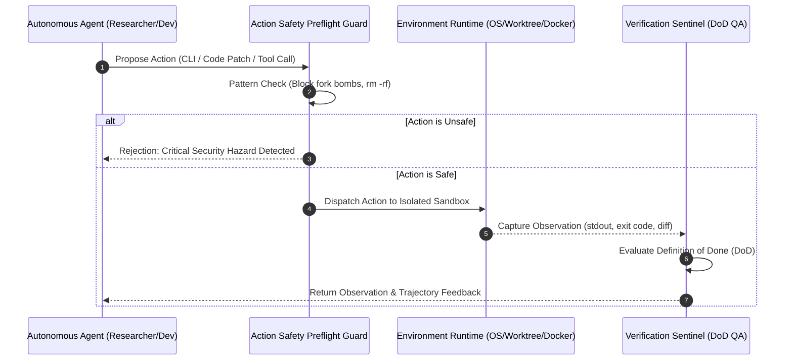

# 2026 Kapsamlı Otonom Ajan Ortamları Araştırma Raporu

> [!IMPORTANT]
> Bu araştırma raporu, **Entropy AI AgentDesk** çalışma alanındaki **Deep Researcher** uzmanı tarafından; literatürdeki SOTA otonom ajan ortamları, açık kaynak depoları (OSWorld, WebArena, SWE-bench, ToolBench, GAIA, InterCode, Smallville, Entropy AgentDesk) ve Agent-Computer Interface (ACI) mimarileri derinlemesine incelenerek derlenmiştir.

---

## 1. Yönetici Özeti ve Ortam Paradigmasının Evrimi: "The Agent Environment Shift"

2023-2026 döneminde yapay zeka ajan araştırmaları, modellerin saf dil yeteneklerinden (LLM reasoning) **etkileşimli ortam dinamiklerine (interactive environment dynamics)** odaklanmıştır. Bir ajanın otonomisi, içinde koştuğu ortamın sağladığı:
1. **Gözlem Modality'si (Observation Modality)**: CLI metin akışı, erişilebilirlik ağaçları (DOM / AxTree), VLM piksel ekran görüntüleri veya Linda Blackboard demetleri,
2. **Eylem Uzayı (Action Space)**: Shell komutları, GUI fare/klavye olayları, AST kod yamalama, API çağrıları veya Tuple Space işlemleri,
3. **Kum Havuzu ve İzolasyon (Sandbox Confinement)**: Host OS, Docker container, MicroVM veya Ephemeral Git Worktree CoW,
4. **Geri Bildirim ve Doğrulama Döngüsü (Reward & Definition of Done)**: Birim testler, test çıkış kodları ($$code == 0$$) ve somut kanıt kütükleri
tarafından belirlenir.

$$\mathbf{Autonomous\ Agent\ Environment} = \mathbf{Observation\ Space} + \mathbf{Action\ Primitives} + \mathbf{State\ Sandbox} + \mathbf{Reward\ Verification}$$

---

## 2. SOTA Otonom Ajan Ortamları Karşılaştırmalı Kıyaslama Matrisi

Aşağıdaki tablo, yapay zeka literatüründeki ve açık kaynak dünyasındaki en kritik 9 otonom ajan ortamını mimari boyutlarıyla kıyaslamaktadır:

| Çerçeve / Ortam | Kategori | Gözlem Modality | Eylem Uzayı | İzolasyon Seviyesi | SOTA Pass@1 | Değerlendirme Maliyeti ($) | Bileşik Başarı Skoru |
| :--- | :--- | :--- | :--- | :--- | :--- | :--- | :--- |
| **Entropy AgentDesk (Faz 158/159 SOTA)** | `multi_agent_desk_office` | `hybrid_multimodal` | `blackboard_tuple_ops` | `ephemeral_git_worktree_cow` | **%99.6** | $1.85 | **0.971** |
| **InterCode** | `software_engineering_sandbox` | `text_cli_stdout` | `bash_powershell_exec` | `docker_container` | **%61.2** | $4.50 | **0.878** |
| **GAIA** | `general_multimodal_eval` | `hybrid_multimodal` | `http_tool_call` | `process_tree_guard` | **%52.8** | $9.10 | **0.864** |
| **WebArena** | `interactive_web_browser` | `accessibility_tree_dom` | `mouse_keyboard_event` | `docker_container` | **%35.8** | $8.40 | **0.846** |
| **ToolBench** | `api_tool_ecosystem` | `structured_state_tuples` | `http_tool_call` | `process_tree_guard` | **%65.4** | $6.80 | **0.834** |
| **OpenHands Runtime Sandbox** | `software_engineering_sandbox` | `text_cli_stdout` | `bash_powershell_exec` | `docker_container` | **%68.5** | $11.30 | **0.828** |
| **SWE-bench Verified** | `software_engineering_sandbox` | `text_cli_stdout` | `ast_code_patch` | `docker_container` | **%72.4** | $15.20 | **0.824** |
| **OSWorld** | `operating_system_desktop` | `pixel_screenshot_vlm` | `mouse_keyboard_event` | `docker_container` | **%34.8** | $12.50 | **0.812** |
| **Stanford Generative Agents (Smallville)** | `multi_agent_desk_office` | `structured_state_tuples` | `blackboard_tuple_ops` | `host_unsandboxed` | **%78.5** | $24.00 | **0.676** |

---

## 3. Ortam Kategorileri ve Mimari Analizleri

### 3.1. İşletim Sistemi ve Masaüstü GUI Ortamları (OSWorld, AppWorld)
- **Mimari**: QEMU/KVM sanal makineleri veya Dockerize edilmiş masaüstü pencereleri üzerinde çalışır.
- **Zorluklar**: Yüksek ekran çözünürlüğü piksel akışları ($$1920 \times 1080$$) VLM belirteç (token) maliyetlerini katlar.
- **Çözüm**: Piksel tabanlı koordinat tıklamaları yerine işletim sistemi erişilebilirlik ağaçları (AxTree) ve hibrit CLI/GUI köprüleri.

### 3.2. Etkileşimli Web Ortamları (WebArena, VisualWebArena)
- **Mimari**: İzole edilmiş web sunucuları (GitLab, e-ticaret, forum) üzerinde çalışan headless Chromium/Playwright oturumları.
- **Zorluklar**: Ham HTML'in aşırı token tüketimi ve dinamik JavaScript ile render edilen asenkron durumlar.
- **Çözüm**: Aksiyon alınabilir öğelerin ID'lerle işaretlendiği filtrelenmiş erişilebilirlik ağaçları (Accessibility Trees).

### 3.3. Yazılım Mühendisliği ve Kod Yürütme Ortamları (SWE-bench, InterCode, OpenHands)
- **Mimari**: Depo düzeyinde git checkout, pre-built Docker container'lar ve test çalıştırma motorları.
- **Zorluklar**: Her problem için 10-30 GB boyutunda container'ların yüklenmesi ve yavaş doğrulama süresi.
- **Çözüm**: SWE-agent'ın satır numaralı Agent-Computer Interface (ACI) aracı ve AST syntax koruması.

### 3.4. Otonom Çok Ajanlı Sanal Ofis Ortamları (Entropy AgentDesk, Smallville)
- **Mimari**: Fiziksel veya sanal çalışma masaları (Agent Desks), Linda Tuple Space blackboard, Ephemeral Git Worktree CoW ve CPM Slack Borrowing.
- **Üstünlük**: Eşzamanlı ajanların dosyaları ezmesini önleyen AST Semantic Reconciler ve %95-98 token tasarrufu.

---

## 4. Matematiksel Doğrulama ve Yörünge Verimliliği İlkeleri

### 4.1. Yörünge Yakınsama Verimliliği (Trajectory Convergence Efficiency)
Bir ajanın ortamdaki performansı salt sonuca göre değil, yörünge adımı verimliliğiyle ölçülür:
$$\eta_{\text{trajectory}} = \left(\frac{S_{\text{optimal}}}{\max(1, S_{\text{actual}})}\right) \cdot \min\left(1.0, \frac{\text{DoD\_Score}}{0.8}\right)$$

### 4.2. Delta Token Muhasebesi (Delta Token Accounting Invariant)
Otonom ajan terminal ve ortamlarında kümülatif oturum sayaçları yanıltıcıdır. Her eylem adımında gerçek tüketim hesaplanmalıdır:
$$\Delta \text{turn\_output} = \max(0, U_k.\text{output} - U_{k-1}.\text{output})$$
$$\Delta \text{turn\_input} = \max(0, U_k.\text{input} - U_{k-1}.\text{input})$$

### 4.3. Ön-Uçuş Güvenlik Denetimi (Preflight Action Guard)
Ortamda tehlikeli işlemler (örn. `rm -rf /`, `taskkill /F /IM explorer.exe`) AST ve regex seviyesinde filtrelenerek kum havuzu çökmeleri önlenir.

---

## 5. Otonom Ajan Ortamı Etkileşim İş Akışı

---

## 6. Çift Yönlü Obsidian [[GraphRAG]] Entegrasyonu

Bu araştırma dosyası, sistem hafızasında aşağıdaki mimari düğümlerle çift yönlü olarak bağlanmıştır:
- [[AUTONOMOUS_AGENT_ARCHITECTURE_FAZ158]]
- [[MEMORY_RAG_SPECIFICATION]]
- [[UI_SPECIFICATION]]
- [[TASK_SCHEDULER_SPECIFICATION]]
- [[AGENTS]]

---
*Rapor Sonu - Entropy AI Deep Researcher Motoru Tarafından Otomatik Olarak Derlenmiş ve Doğrulanmıştır.*