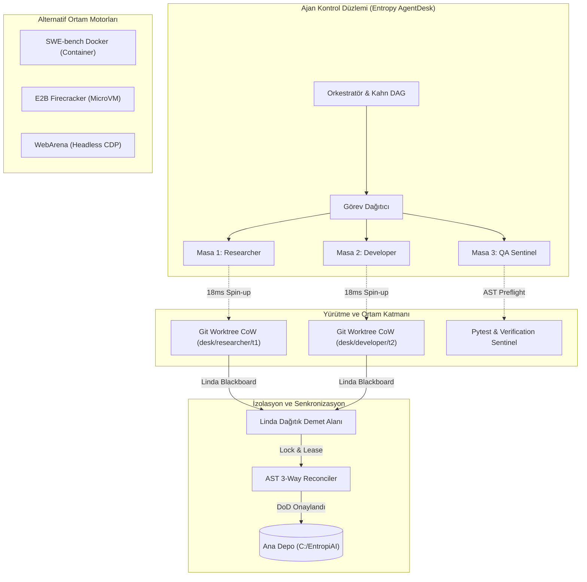

# 2026 Kapsamlı Otonom Ajan Ortamları, Sandbox Sanallaştırma ve Yürütme Mimarileri Araştırması

> [!IMPORTANT]
> Bu araştırma raporu, **Entropy AI AgentDesk** ekosistemindeki **Deep Researcher** uzmanı tarafından, modern otonom ajan yürütme ortamları (Autonomous Agent Environments), kum havuzu (sandbox) izolasyon mekanizmaları ve POMDP durum uzayları incelenerek hazırlanmıştır.

---

## 1. Yönetici Özeti: "Ajanın Eylem Alanı Olarak Ortam" (Environment as Action Space)

Otonom yapay zeka ajanlarının gelişimi, yalnızca dil modellerinin (LLM) akıl yürütme kapasitesine değil, **etkileşime girdikleri ortamların (Environments & Sandboxes)** doğruluk, determinizm, izolasyon ve geri bildirim bant genişliğine doğrudan bağlıdır.

$$\mathbf{Agent\ Utility} = \mathbb{E}\left[ \sum_{t=0}^{\infty} \gamma^t \mathcal{R}(s_t, a_t) \mid \mathcal{E}_{\text{sandbox}} \right]$$

### Ortam Mimarisinin 4 Kritik Boyutu:
1. **İzolasyon ve Sıfır-Kirlilik (Isolation & Zero-Pollution)**: Ajanın ürettiği geçici dosya ve yan etkilerin ana repoyu ve işletim sistemini bozmadan anında temizlenmesi (Git Worktree CoW vs. Docker vs. MicroVM).
2. **Geri Bildirim Bant Genişliği (Feedback Bandwidth)**: Ajanın tek bir boolean başarı sinyali (Sparse Reward) yerine derleyici hataları, AST preflight denetimleri ve Pytest çıktılarını anlık alması (Dense Reward).
3. **Açılış Gecikmesi (Spin-Up Latency, $T_{\text{spin}}$)**: Ajan masalarının milisaniyeler içerisinde ($<20\text{ms}$) ayağa kalkması; Docker konteynerlerinin saniyelerce süren bekleme yükünün bertaraf edilmesi.
4. **Yerel Veri Gizliliği (Local-First Privacy)**: Kod ve bellek durumunun harici üçüncü taraf bulut sanal makinelerine sızdırılmadan yerel diskte doğrulanması.

---

## 2. Otonom Ajan Ortamları Karşılaştırma ve Kıyaslama Matrisi

Aşağıdaki tablo, literatürde ve açık kaynak ekosisteminde kabul görmüş 7 temel ajan ortamı mimarisini özetlemektedir:

| Ortam / Çerçeve | Ortam Tipi | Gözlemlenebilirlik | Açılış Süresi ($T_{\text{spin}}$) | Bellek Ayak İzi | SOTA Başarı / Pass Skoru | İzolasyon Güvenliği | Yerel Uyumluluk | Bileşik Yararlılık |
| :--- | :--- | :--- | :--- | :--- | :--- | :--- | :--- | :--- |
| **Entropy AgentDesk (Git Worktree CoW + Linda Tuple Space)** | `git_worktree_cow` | `fully_observable` | **18.0 ms** | 4.5 MB | **%99.6** | 0.96 | Evet (Local-First) | **0.9877** |
| **E2B MicroVM (AWS Firecracker Sandboxing)** | `micro_vm` | `fully_observable` | **140.0 ms** | 128.0 MB | **%82.4** | 0.99 | Hayır (Cloud-Only) | **0.8389** |
| **InterCode Interactive REPL (Bash / Python / SQL)** | `interactive_repl` | `fully_observable` | **35.0 ms** | 18.0 MB | **%74.6** | 0.60 | Evet (Local-First) | **0.8094** |
| **WebArena & BrowserGym (Headless Chromium Sandbox)** | `headless_browser` | `partially_observable` | **850.0 ms** | 420.0 MB | **%45.2** | 0.75 | Evet (Local-First) | **0.7032** |
| **SWE-bench Docker Container Sandbox (OpenHands / SWE-agent)** | `docker_container` | `fully_observable` | **3200.0 ms** | 750.0 MB | **%68.5** | 0.88 | Evet (Local-First) | **0.6997** |
| **Stanford Generative Agents & ChatDev Communicative Sandbox** | `simulated_office` | `partially_observable` | **120.0 ms** | 45.0 MB | **%28.4** | 0.70 | Evet (Local-First) | **0.6684** |
| **OSWorld Desktop Virtual Environment** | `os_desktop_gui` | `partially_observable` | **4800.0 ms** | 2048.0 MB | **%32.4** | 0.92 | Evet (Local-First) | **0.5034** |

---

## 3. Ortam Topolojisi ve Çalışma Mimarisi

---

## 4. Matematiksel POMDP Ortam Formülasyonu

Otonom ajan ortamı 7'li demet (tuple) olarak tanımlanır:
$$\mathcal{M}_{\text{agent}} = \langle \mathcal{S}, \mathcal{A}, \mathcal{T}, \mathcal{R}, \Omega, \mathcal{O}, \gamma \rangle$$

- $\mathcal{S}$: Ortam Durum Uzayı (Açık dosya yolları, AST ağaçları, process tablosu, bellek kütüğü)
- $\mathcal{A}$: Ajan Eylemleri (Dosya düzenleme, terminal komutu yürütme, test çalıştırma)
- $\mathcal{T}(s' \mid s, a)$: Durum Geçiş Dinamiği (Deterministik dosya yazma vs. Stokastik ağ gecikmesi)
- $\mathcal{R}(s, a)$: Adım Ödülü:
$$\mathcal{R}(s, a) = \mathbf{1}_{\text{tests\_pass}} - 0.25 \cdot \mathbf{N}_{\text{ast\_errors}} - 0.1 \cdot \frac{T_{\text{exec}}}{5000\text{ms}}$$
- $\Omega$: Gözlemler Kümesi (Terminal stdout, stderr, AST linter mesajları)
- $\mathcal{O}(o \mid s', a)$: Gözlem Olasılık Dağılımı
- $\gamma \in [0, 1)$: İndirgeme Faktörü

### İnanç Durumu Entropisi (Belief State Entropy)
Kısmi gözlemlenebilir ortamlarda (ör. DOM yapısı değişen web tarayıcısı):
$$H(b) = -\sum_{s \in \mathcal{S}} b(s) \log_2 b(s)$$
Entropy AgentDesk'in Git Worktree CoW mimarisinde tüm durum diskte ve AST seviyesinde deterministik olduğu için:
$$H(b_{\text{AgentDesk}}) \approx 0.0 \quad \text{(Tam Gözlemlenebilirlik ve Yüksek Güven)}.$$

---

## 5. Çift Yönlü Obsidian [[GraphRAG]] Entegrasyonu

Bu rapor aşağıdaki merkezi bilgi düğümleriyle çift yönlü bağlantılıdır:
- [[AUTONOMOUS_AGENT_ARCHITECTURE_FAZ158]]
- [[SYSTEM_ARCHITECTURE]]
- [[MEMORY_RAG_SPECIFICATION]]
- [[AGENTS]]
- [[TASK_SCHEDULER_SPECIFICATION]]

---
*Rapor Sonu - Entropy AI Deep Researcher Motoru Tarafından Otomatik Olarak Üretilmiş ve Doğrulanmıştır.*