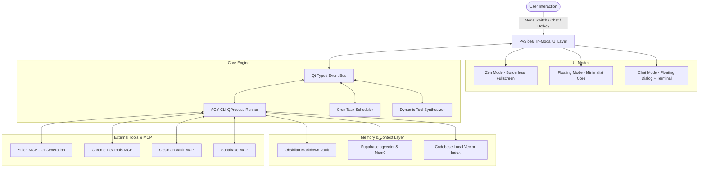

# System Architecture Specification - Entropy AI

## 1. Architectural Overview

Entropy AI is engineered as an Agentic Desktop Operating System (Agentic OS) that decouples user-facing multimodal interaction from model reasoning and execution.

---

## 2. Core Subsystems

### 2.1 UI Presentation Layer (PySide6)
- **Zero-Flicker Window Switching**: Seamless morphing between Zen (borderless fullscreen), Floating (frameless, translucent, pinned widget), and Chat (resizable modal with terminal drawer).
- **Core Visualizer**: A custom `QPainter` / OpenGL animated pulsing orb widget reacting dynamically to token streaming frequencies.
- **Multimodal Clipboard Buffer**: Intercepts `QClipboard` images (`QImage`), serializes to temporary staging buffers, and binds to `agy` CLI multimodal prompts.

### 2.2 Antigravity (AGY) Process Bridge
- Direct execution of `agy` CLI using `QProcess` with non-blocking line-by-line stdout/stderr parsing.
- Emits real-time Qt signals:
  - `sig_model_detected(str)`: updates model badge dynamically.
  - `sig_token_stream(str)`: triggers terminal output and core pulsing.
  - `sig_turn_finished(dict)`: updates conversation context window and token statistics.
- Implements context window sliding truncation (e.g. keeping 20 turns) to prevent latency slowdowns.

### 2.3 Hybrid Cognitive Memory System
- **Working Memory**: In-memory message buffers for the active turn.
- **Episodic Memory**: Recorded in Supabase pgvector with timestamp, importance score, and session tags.
- **Semantic Memory**: Distilled facts in Obsidian Vault markdown files (`MEMORY.md`, `Concepts/`, `Projects/`).
- **RecollectionEngine**: Computes hybrid score:
  $$\text{Score} = 0.50 \times \text{Similarity} + 0.30 \times \text{Importance} + 0.20 \times \text{Recency}$$

### 2.4 Autonomous Scheduler
- Uses Python `apscheduler` / Qt timers for cron intervals (every N minutes, hourly, daily, weekly).
- Dispatches automated maintenance, codebase audits, and memory consolidation tasks into the background `agy` queue.

### 2.5 Windows Autostart & Platform Hooks
- Registers in Windows Registry `HKCU\Software\Microsoft\Windows\CurrentVersion\Run` or `shell:startup` shortcut.
- Global desktop hotkey hook (`Win + Alt + E` or double-click on Floating Core) to summon/minimize Entropy AI.

### 2.6 Dynamic Tool Synthesis & Sandboxed Execution
- **Pydantic AI Strong Typing**: Automatically generates type-safe schemas, `RunContext` dependency injection, and `ModelRetry` self-healing loops for agent-written tools.
- **Two-Tier Permission Model**:
  - *Tier 1 (Autonomous / Safe)*: Read-only codebase queries, AST inspection, and vector memory lookups execute without user interruption.
  - *Tier 2 (Interactive / Mutating)*: File overwrites/deletions, arbitrary terminal commands, or network requests require a one-click confirmation prompt in the active UI modal.
- **Filesystem Boundary**: Confines operations strictly to the selected project root, preventing collateral damage to host system files.

