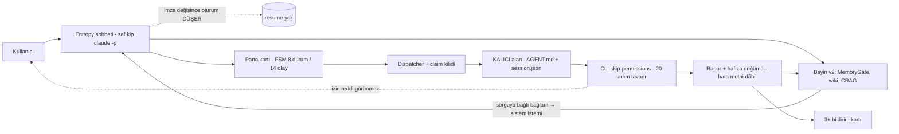
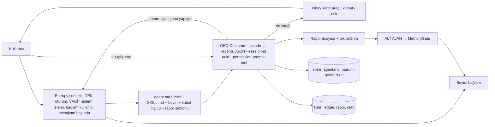

# Faz 14 — Analiz ve Plan: "Bu kadar basit bir sistem" — nerede yanlış yaptık, bugünkü mimari, istenen mimari, fark ve yol

Tarih: 2026-09-11 · Branch `ai/v0.1.7` · Taban `v0.11.0` · Orkestratör: Claude Fable 5.1 · Dayanak: `2026-09-11_Faz14_Arastirma_A_Mevcut_Mimari_ve_Hata_Izi.md` (hata izi, mevcut harita, özeleştiri) ve `2026-09-11_Faz14_Arastirma_B_Istenen_Mimari_ve_Fark_Analizi.md` (CLI yetenekleri, istenen harita, fark, dilimler); ek: `2026-09-11_Arastirma_LangChain_LangGraph_LangSmith.md`. Her iki not salt okunur ve model çağrısız yazıldı (kota 0).

## 0. Anladığım (bağlayıcı tanım)
Bir yetenek çalıştırılması istendiğinde Entropy: SKILL.md'yi alır → o iş için bir `agent.md` üretir → ajana beyinden ilgili hafızayı verir → seçili motorla (Entropy'nin o anki motoru ya da ajana seçilen) **ayrı bir CLI oturumu** açar → oturum işi yapar, raporu **anlık** geri iletir → Entropy sana "ajanın şunu şunu yaptı" der → ajan **kendini siler**; hafızaya girecek bilgiyi **alt ajan** yazar; markdown işleri küçük Python betikleriyle. Kalıcı adlı ajanlar (araştırmacı/yazar/analist) istenmedi. Sohbet önceki mesajı hatırlar; "onaylıyorum" dediğinde neyi onayladığını bilir. Düzen: 7 bölüm üstte küçük düğme; sohbet sağda tam yükseklik panel, hafıza ve sohbet oradan sekmeyle. Sıfır API anahtarı. Gerekirse RAG/hafıza sıfırlanır. Ölçüt: senin gerçek kullanımın.

## 1. Nerede yanlış yaptık (özeleştiri; her madde A notunda kanıtlı)
1. **Ölçütümüz kapı ve test sayısıydı, senin senaryon değil.** 2.648 test ve sıfır ihlalli kapılar, "iki ardışık sohbet turu birbirini görüyor mu" sorusunu hiç sormuyordu; bunu ölçen test 30 satırdı ve yazılmamıştı.
2. **"Yeşil" ürüne ulaşmadı.** 13-A2'nin beyin kısa devresi düzeltmesi `dist_check/`e derlendi, `dist/`e aynalanması sana bırakıldı; sen 22:40–23:49 arasında düzeltilmiş sandığımız hatayı üç kez yaşadın. Kapanış ölçütü "build exit 0" değil "senin koşturduğun ikili yeni sürüm" olmalıydı.
3. **İzin/onay yüzeyi hiç kurulmadı.** Saf kip CLI'ın varsayılan istemini düşürürken izin diyaloğunu da düşürdü, yerine hiçbir şey konmadı; `[DESK]`/kural/beceri onayları var ama araç iznini kapsamıyor. "Onaylıyorum" dediğinde onaylanacak bir şey uygulamaya hiç ulaşmamıştı.
4. **Test artıkları üretim hafızasına üçüncü kez sızdı.** Yalıtım eklendi ama yazma tarafı hâlâ hata metnini kabul ediyor; `'list_iterator'` hatası ve 12 pytest izli düğüm gerçek hafızanda.
5. **Kalıcı ajan + ağır pano, senin istediğin geçici oturum yerine seçildi.** Gereken parçalar (yetenek → istem, izole cwd, tek turluk kimlik) zaten vardı; fazlalık kalıcı oturum defteri, imza rotasyonu, claim kilidi ve devir bütçesiydi.
6. **Sohbet sürekliliğini "CLI hallediyor" varsaydık.** Süreklilik bellekteki tek değişkene bağlıydı; disk geçmişi 6 tur × 100 karakter olarak ekleniyor, `--resume` dalında hiç eklenmiyordu.
7. **Sadeleştirme gürültüyü artırdı.** Bir kart koşusu dört ayrı üreticiden ≥ 3 bildirim kartı basıyor.
8. **ARCHITECTURE.md "yaşayan" değildi** (`agents/` için %59 eksik).
9. **Kotayı sana değil kendi ispatımıza harcadık.** 13-C ofis zincirine 133,5k; aynı gece senin iki gerçek kartın 20 adım tavanında öldü (12,9k).

## 2. Yaşadığın arızalar → kök neden (A notu §1)
| Arıza | Kök neden | Kanıt |
|---|---|---|
| "onaylıyorum" → "bağlam bana ulaşmadı" | Saf kipte sistem istemi sorguya bağlı bilişsel bağlam taşıyor → imza her turda değişiyor → `_forget_stale_session` oturumu düşürüyor; yeni oturum sohbet özetini de almıyor | 4 ardışık tur ölçümü: `NO-RESUME / RESUME / NO-RESUME / NO-RESUME`; `claude_bridge.py:1518-1546, 1743-1771` |
| "İki komut onay penceresinde bekliyor" (pencere yok) | stream-json'daki izin reddi köprüde hiç işlenmiyor; reddedilen araç modele hata metni olarak dönüyor, model "onay bekliyor" uyduruyor; "klasörü oluşturdum / klasör yok" iki yönlü uydurma | `consume_stream :1113-1245`; `permission_denial` için 0 isabet |
| Aynı 4.501 baytlık "beyinden yanıtlandı" ×3 | Kısa devre 13-A2'de kapandı ama senin exe'n eski build'di | `Wiki/queries/…{,-2,-3}.md` 3 × 4.501 B, güven 0,49–0,52, "yanıt" kimlik düğümü |
| Sonraki kart `failed` | `MAX_STEPS_PER_CARD = 20`; canlı denetim 21. adımda kesiliyor | ledger: `[ADIM SINIRI] 21 > 20` iki kartta |
| `'list_iterator'` hatası hafızada | Başarısız turun hata metni `success`e bakılmadan `store_node(importance=0.85)`; kapı hata günlüğünü reddetmiyor; kaynak `tests/test_agy_bridge.py` "Test Görev" | DB: 2 düğüm, biri `pytest-of-batu_…` kaynaklı; 12 pytest izli düğüm |
| Entropy kendi kodunu düzenledi | Sohbet varsayılanı `acceptEdits`; yazma niyeti sezgisi `Edit,Write,Bash` ekliyor; `--add-dir` proje kökü | `git diff` `agy_bridge.py` 10+/2− commit'siz (aşağıda karar) |
| "Fable 5.1 mi?" | Üst çubuk doğru (canlı `system.init`), ledger yanlış: sohbet satırı var olmayan `self.model`'i okuyor → `model=''` | ledger son 6 sohbet satırı boş; kart satırları dolu |
| "oturum yok", kadro | agy'de kimlik ancak `result` gelirse yazılıyor; adım sınırında ölen kartta gelmiyor; kadro 5 tanım / 3 dosya | `session.json` kimliksiz |
| Aynı rapor ×2, üç bildirim | Tekilleştirme çözülmüş yola bakıyor, ikinci koşum yeni dosya; `task_report_ready` + `report_created` aynı olay için iki kart; `[OTONOM PLANLI GÖREV]` etiketi regex ile yakalanıyor | 5 `report_created.emit` noktası |
| Dakikada bir "Pano ayrışması" | Silinmiş kartın (R-13A2-1) her pano yazımında `board.drift` üretmesi | 10 olay / 5 saat |

## 3. Bugünkü mimari (haritası)
158 dosya / 81.193 satır (`ui` 57 dosya, `agents` 22, `brain` 27, `core` 25, `desk` 10, `skills`/`platform`/`tools`); veri kökü **üç parçalı** (`C:\EntropiAI\.entropy` ayarlar, `~/.entropy` DB'ler, bayat `%LOCALAPPDATA%`), 7 modül `Path.home()/".entropy"` yolunu sabit yazıyor.

"Bir yetenek koştur → rapor al" bugün fiilen **19 adım** (yetenek çözümü, yazma niyeti sezgisi, proje kilidi, 4.000 tokenlik bağlam, 7–15 KB sistem istemi, imza karşılaştırması, 16 bayraklı argv, stream tüketimi, 20 adımlı araç turu, blok tüketimi, geçmiş/Sessions, ledger, kart bitişi, rapor, hafıza, çift kart) — A notu §2.4.

## 4. İstenen mimari (haritası)

Döngü sözleşmesi (B notu §3.2): (1) `agent.md` küçük saf Python betiğiyle üretilir — claude'da dosya bile yazılmaz, `--agents` JSON'u argv'de taşınır; agy'de geçici `.agents/agents/<slug>/agent.md` koşu sonunda silinir. (2) Her koşu yeni uuid, kalıcı oturum deposuna yazılmaz, `--no-session-persistence`. (3) Canlı akış zaten var (`bus.agent_stream`); eksik olan sohbette görünür satır. (4) Onay: `--permission-prompt-tool` + Entropy'nin kendi stdio MCP onay sunucusu; istek "bekleyen işler"e kart olarak düşer, "onaylıyorum" o isteği çözer; `--dangerously-skip-permissions` koşullu olur. (5) Rapor `Entropy/Reports/`, başlık H1'den. (6) Hafızayı alt ajanın ürettiği JSON ile MemoryGate yazar. (7) Silme: `agent.md`, sistem istemi dosyası, oturum; kalan: ledger, rapor, olay, hafıza düğümü.

CLI gerçekleri (B notu §2, `claude` 2.1.268 / `agy` 1.2.0 ölçüldü): claude'da `--session-id/--resume/--fork-session`, `--agents`, `--permission-prompt-tool`, `--allowedTools`, `--system-prompt-file`, stream-json var; agy'de bunların çoğu yok (22 bayrak sayıldı) → geçici ajan agy'de dosya ile doğar, **gerçek onay yalnız claude yolunda** kurulabilir.

## 5. Fark tablosu (B notu §6, özet)
| Bileşen | Bugün | İstenen | Ne yapılacak |
|---|---|---|---|
| Ajan modeli | kalıcı kadro (AGENT.md + session.json) | yetenek başına geçici | `--agents` koşu başına üretilir; kadro **gizlenir** (Desk/pano ona bağlı; silinmez) |
| `agent.md` üretimi | yok | SKILL.md + beyin + ölçüt + şablon | **yeni**, saf Python, Qt'siz |
| Sohbet sürekliliği | imza değişince düşer; 6×100 karakter | iki tur bağlam | sistem istemi sabit, bağlam kullanıcı mesajına iner, `--resume` zinciri |
| Onay | skip bayrağı; izin reddi görünmez | uygulama içi gerçek onay | **yeni**: stdio MCP + `--permission-prompt-tool`; tek "bekleyen işler" kuyruğu (`desk_admin` şeması genişler) |
| Canlı akış | sinyal var, sohbette yok | "ajan şunu yapıyor" | render katmanı |
| Hafıza yazımı | Entropy yazıyor, hata metni dâhil | alt ajan yazar | çağıran değişir; kapıya hata/günlük reddi bandı |
| Kart adım tavanı | 20, aşınca `failed` | yeteneğe göre, aşınca `review` | ölçekle |
| Bildirim | 3+ kart / koşu | tek kart | üreticiler birleşir |
| Ledger `model` | boş | gerçek model | tek satır düzeltme |
| Veri kökü | üç parçalı | tek | `core/paths.py` tek kaynak |
| Pano FSM | 8/14/13 | geçici koşu 3 durum | **dokunma** (Desk kırılır), geçici koşu alt küme kullanır |
| Düzen | NavList sol, graf sağ, sohbet alt | 7 düğme üst, sağ tam panel Sohbet/Hafıza | **yeniden yaz** (B notu §4 spec: üst şerit 48 px, içerik ≥ 560 px, sağ panel 420/320 px, çekirdek ≥ 48 px) |
| Sohbette proje kökü | yazılabilir (sezgiyle) | salt okunur; kod değişikliği yalnız onaylı kart | bayraklar |
| Proje `dist/` | `dist_check`'te kalabiliyor | senin ikilin = son sürüm | faz kapanış ölçütü |

## 6. LangGraph kararı
İki kez sordun, iki kez ölçüldü: LangGraph 1.2.11 MIT; ama `langgraph → langchain-core → langsmith` zorunlu zincir (PyPI 2026-09-11), "yalnız langgraph" kurulumu **yok**; asgari ağaç ~18 paket (bugün 5); durum ikili msgpack (kasa `.md` sözleşmesi bozulur); `langgraph-api` Elastic-2.0 ve yerel Studio bile LangSmith anahtarı istiyor; CLI arkalı model sarmalayıcı token ölçümünü kaybediyor. İstenen 7 adımlı döngü LangGraph'sız 5 küçük bileşenle yazılıyor ve zaten büyük ölçüde var. **Karar: alınmaz; dört desen alınır** (yeniden-oynatma güvenliği, interrupt = onay bekleme sözleşmesi, kota sınırlı fan-out, trace şeması) — ADR-0010. İstersen 10k'lık izole spike yine mümkün.

## 7. Faz 14 dilimleri — kabul ölçütü senin senaryoların canlı
| Dilim | İş | Senaryo (kabul) | Ajan | Kota |
|---|---|---|---|---|
| **14-A Sohbet sürekliliği** | sistem istemi sabit, bağlam kullanıcı mesajına iner, `_forget_stale_session` yalnız model/efor değişiminde, ledger `model` düzeltmesi, sohbette proje kökü salt okunur | **S1:** iki tur; ikincisi birincinin konusunu doğru anar; `--resume` argv'de görünür | agy-integration-engineer | 10–15k |
| **14-B Gerçek onay** | stdio MCP onay sunucusu + `--permission-prompt-tool`; skip bayrağı koşullu; tek "bekleyen işler" kuyruğu + onay kartı; izin reddi olayı köprüde | **S2:** "google-flow ile video üret" → onay kartı (araç/komut/risk) → "onaylıyorum" → komut koşar; reddet yolu | agy + ui | 15–25k |
| **14-C Geçici ajan döngüsü** | `agent.md` üretici, geçici oturum, canlı akış satırı, adım tavanı yeteneğe göre (aşınca `review`), kendini silme, tek bildirim; kadro gizlenir | **S3:** "media-agency-soldier ile canivopets.com'u sıfırdan araştır" → akış → rapor → bildirim → `agent.md`/oturum diskte yok, ledger var | agy + ui | 40–60k |
| **14-D Hafıza yazarı alt ajan** | MemoryGate'e hata/günlük/yığın izi reddi bandı; pytest artığı 12 düğüm arşive; alt ajan JSON → kapı | **S4:** 14-C raporundan sonra yeni sohbette Entropy bulguyu kaynaklı hatırlar; K3 ≤ %5, K12 artmaz | memory-rag-engineer | 10–20k |
| **14-E Yeni düzen** | 7 düğme üstte, sağ tam panel Sohbet/Hafıza, çekirdek üstte, tek durum satırı; üst çubuk kapısı `navStrip` ayrı grup | **S5:** düzen; `ui_audit --gate --final` exit 0 | ui-engineer + repo-curator (kapı, ADR-0010) | 0 |
| **14-F Kapanış** | tam süit, build, **`dist/` senin ikilin**, veri kökü tek kaynak, R-13A2-1 drift döngüsü, ARCHITECTURE ölçümle eşit, S1–S5 gerçek ekranda birlikte | tümü canlı | qa-build-engineer | 0–20k |

Sıra: 14-A → 14-B → 14-C → 14-D → 14-E → 14-F (14-E, 14-A ile paralel olabilir). Toplam gerçekçi kota **75–140k**, canlı doğrulamalar ayrı turlarda (13-C dersi: tek tur tavanı aşabiliyor). Etiketler `v0.11.1 … v0.12.0` (şim kaldırılır).

## 8. Hafıza sıfırlama
**Şimdilik hayır** (B notu §7.1): şema Faz 11-B'de temizlendi (Hit@1 9/10, gürültü %0); değişen **yazar** (Entropy → alt ajan), şema değil. Tetik ölçütü: 14-D sonrası K3 > %5 veya K12 artışı → önce `dream.forget_stale` + gri tur; yine yetmezse yedek + yeniden kurulum (MEMORY.md ve wiki korunur). 12 pytest artığı düğüm 14-D'de arşivlenir.

## 9. Senden kararlar
1. Bu plan ve dilim sırası (14-A…F) onay?
2. Kota: 75–140k gerçekçi; tavan **150k** (canlı dilimler ayrı turlarda) onay?
3. Entropy'nin sohbette kendi koduna yaptığı commit'siz düzenleme (`agy_bridge.py`: `stdout.close()` iki yerde try/except'e alındı; zararsız koruma): **testle birlikte tut** mu, **geri al** mı?
4. LangGraph: desenler (önerim) mi, 10k spike mı?
