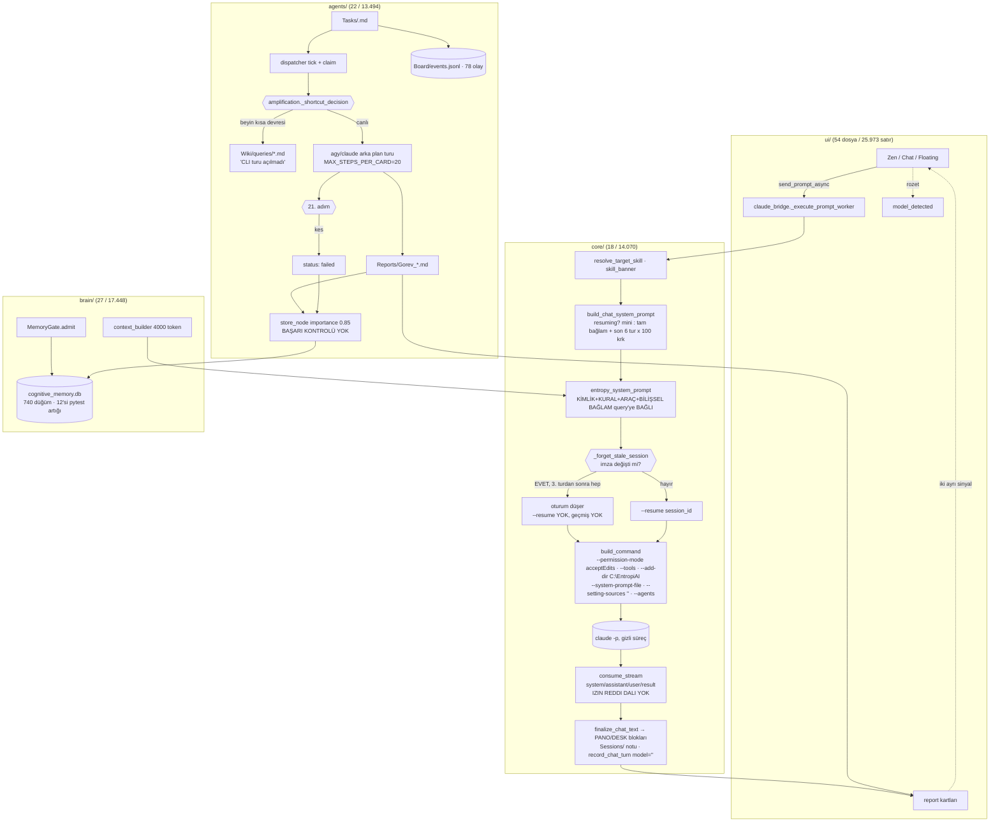

# Faz 14 · Araştırma/Denetim Notu A — Mevcut mimari haritası ve kullanıcının yaşadığı hataların koda kadar izi

> Tarih: 2026-09-11 · Depo: `C:\EntropiAI` · HEAD `b2f12b0` (v0.11.0) · Dal `ai/v0.1.7`
> Kip: **SALT OKUNUR** (bu dosya dışında hiçbir şey yazılmadı) · **Model çağrısı yapılmadı** (kota 0)
> Okunanlar: `docs/ARCHITECTURE.md`, `docs/STATE.md` §3, `docs/reports/2026-09-11_Faz13_Ilerleme_Raporu_v0.11.0.md`

## 0. Üç cümlelik özet

v0.11.0'ın 2.648 yeşil testi ve sıfır ihlalli kapıları, kullanıcının fiilen yaşadığı
altı arızanın **hiçbirini** ölçmüyor: sohbet sürekliliği 3. turdan itibaren koda gömülü
bir imza döngüsüyle kopuyor, CLI'ın araç izni reddi köprüde hiç işlenmediği için model
"onay penceresinde bekliyor" diye **uyduruyor**, araştırma kartları `MAX_STEPS_PER_CARD = 20`
tavanına takılıp `failed` oluyor ve başarısız turun hata metni **üretim hafızasına düğüm
olarak yazılıyor**. Kullanıcının 22:40–23:49 arasında gördüğü üç özdeş "beyinden yanıtlandı"
dökümü, Faz 13-A2'de düzeltilmiş bir hatanın **kullanıcının exe'sine hiç ulaşmamış**
olmasından kaynaklanıyor (`dist_check` aynalanmadı) — yani "düzelttik" dediğimiz şey
üründe çalışmıyordu. Bugünün mimarisi 158 modül / 81.193 satır ile `ARCHITECTURE.md`'deki
tablodan %35 daha büyük; "yaşayan mimari" belgesi de sapmış durumda.

---

## 1. Arıza → kök neden tablosu

| # | Arıza (kullanıcının gördüğü) | Kök neden | Dosya:satır | Kanıt / ölçüm | Hangi fazda girdi |
|---|---|---|---|---|---|
| 1 | "onaylıyorum" dedi, Entropy "bu oturumun bağlamı bana ulaşmadı" dedi | Saf kipte sistem istemi **sorguya bağlı** bilişsel bağlam taşır → her turda imza değişir → `_forget_stale_session` süren oturumu düşürür; üstelik `context_prompt` **düşürmeden ÖNCE** `resuming=True` varsayımıyla kurulduğu için yeni oturum **sohbet özetini de almaz** | `core/claude_bridge.py:1743-1771`, `:1518-1546`, `:1668-1680`; `brain/system_prompt.py:285-318`, `:500-517` | Ölçüm A ve B (aşağıda): 4 ardışık tur → `NO-RESUME / RESUME / NO-RESUME / NO-RESUME`, 2.–4. turlarda sistem isteminde sohbet özeti **yok**. Transkript: `chat_history.json` mesaj 37→39 | Faz 9.9 (`_forget_stale_session`) + Faz 9.2/13 (sorguya bağlı `[BİLİŞSEL BAĞLAM]`) |
| 1b | Sonraki turda **aylar önceki** bir "onay" bulundu | Bağlam kopunca modelin tek kaynağı hibrit geri çağırmadır; `hybrid_recall` tarih/oturum filtresi uygulamaz, `Reports/…` eski bir satırı "bekleyen onay" sandı | `brain/context_builder.py` (bütçe 4000), `core/claude_bridge.py:1656-1660` (`get_mini_cognitive_context` → `recall(limit=2)`) | Transkript mesaj 41: "Kaynak: `…Ürettiğin Google Flow video reklamlarınd.md` satır 48-52" | Faz 11-B/12-A |
| 2 | "İki komut onay penceresinde bekliyor" — uygulamada öyle bir pencere yok | `consume_stream` stream-json'da **izin reddi olayını hiç tanımıyor**: `system/assistant/user/result` dışında dal yok, `permission_denials` alanı okunmuyor. Reddedilen araç modele `tool_result` hata metni olarak döner, köprü onu 300 karaktere kırpıp terminale basar, model bunu "onay bekliyor" diye yorumlar | `core/claude_bridge.py:1113-1245` (dal listesi), `:1198-1215` (tool_result kırpma); `grep permission_denial\|can_use_tool src/entropy` → **0 isabet** | `bus.tool_approval_requested` yalnız `tools/synthesizer.py:115` içinde kullanılıyor — **CLI araç izniyle hiç bağlantısı yok** | Hiç yapılmadı (Faz 8'den beri eksik) |
| 2b | Model "klasörü oluşturdum" dedi, sonraki turda "klasör yok" dedi; ikisi de yanlış raporlandı | Aynı kök: köprü aracın gerçekten koşup koşmadığını **durum olarak** taşımıyor; model kendi anlatısını üretiyor | — | `C:\EntropiAI\google_flow_files\talking_bugs_project` **04:44:11'de gerçekten oluşmuş** (dizin mtime); mesaj 41 (~04:47) "dizin mevcut değil" diyor → **iki yönlü uydurma** | — |
| 3a | Araştırma kartı 3 kez aynı 4.501 baytlık hafıza dökümünü üretti | Beyin kısa devresi kullanıcının **koşan exe'sinde** hâlâ açıktı: 13-A2'nin düzeltmesi `dist_check/` içine derlendi, `dist/`e **aynalanmadı** | `agents/amplification.py` `_shortcut_decision`, `core/config.py:388` (`brain_shortcut_enabled=False`) — kaynak doğru | `Wiki/queries/…raporu{,-2,-3}.md` **3 × 4.501 B**, 22:40:19 / 22:47:01 / 23:49:12, hepsi `task_id: 20260910-224018-…`, güven **0,49 / 0,52 / 0,52**; sunulan "yanıt" **kimlik düğümü**. `STATE.md` §2.10: 13-A2 `dist_check`e derlendi, aynalama kullanıcıya bırakıldı; `dist_check/` dizini hâlâ durur | Faz 12 (kısa devre), 13-A2'de kapandı **ama üründe değil** |
| 3b | Sonraki kart `failed` | **Araç adımı tavanı**: `MAX_STEPS_PER_CARD = 20`; canlı 360° denetim (3 betik + WebSearch + rapor yazımı) 21. adımda kesiliyor | `agents/tasks.py:86`, `:1662`; `core/agy_bridge.py:1492-1500` | Defter: iki kartın da hatası `[ADIM SINIRI] Araç adımı sınırı aşıldı (21 > 20); görev durduruldu.` (`tasks_ledger.db`, `card-20260910-224018-…` ve `card-20260911-042836-…`) | Faz 10 (tavan), hiç gözden geçirilmedi |
| 3c | "`'list_iterator' object has no attribute 'close'`" **gerçek hafızada** | Başarısız arka plan turunun **hata metni**, `success` bayrağına bakılmadan `store_node(category="semantic", importance=0.85)` ile hafızaya yazılıyor; kapı (`MemoryGate`) yalnızca yenilik/kopya bakar, "bu bir hata günlüğü mü" diye **bakmaz**. Test sahtesi (`stdout = iter([])`) bu hatayı üretip aynı yoldan yazdı | **Yazma noktası**: `core/agy_bridge.py:1373-1380`; ikizi `:2446-2460`. **Hatayı üreten test**: `tests/test_agy_bridge.py:500-547` (`MockPopen.stdout = iter([])`, görev adı **"Test Görev"**) | `~/.entropy/cognitive_memory.db` (salt okunur): `list_iterator` içeren **2 düğüm** (2026-09-06 02:42:33 ve 02:43:51), biri `provenance` olarak **`…\pytest-of-batu_\pytest-2259\test_background_task_effort_hi0\…`** taşıyor; toplam **12 düğümde pytest izi**, 740 düğümün 716'sı etkin | Faz ≤8 (fikstür yalıtımı sonradan eklendi) |
| 4 | Entropy sohbette **kendi kaynak kodunu** düzenledi (`agy_bridge.py` `close()` → try/except) | Sohbet turu varsayılan `mode="accept-edits"` → `--permission-mode acceptEdits`, sezgi yazma niyeti görürse `--tools` listesine `Edit,Write,Bash` ekleniyor, `--add-dir <proje kökü>` zaten veriliyor. Yazma yetkisi **sezgiye** bağlı, onaya değil | `core/claude_bridge.py:1365` (varsayılan `accept-edits`), `:1612-1625` (`tools_for`), `:733-734` (`_add_dir(project_dir)`), `:168-169` (`CHAT_TOOLS_WRITE = ["Edit","Write","Bash"]`), `core/provider.py:861-900` (`is_code_modifying_intent`) | `git diff --stat` → `src/entropy/core/agy_bridge.py │ 12 ++++++++++--`; `git blame -L2322,2328` → satır 2324-2327 **`00000000`** (commit'lenmemiş). Değişiklik depoda **var ama commit'siz**, `git log -S"list_iterator"` → **0 commit** | Faz 8'den beri; ürün kuralıyla çelişki Faz 10'da doğdu |
| 5 | "Model gerçekten Fable 5.1 mi?" | Üst çubuk **doğru** (canlı `system.init` olayından beslenir), **defter yanlış**: sohbet satırı `model` alanını `getattr(self, "model", "")` ile okuyor — köprüde böyle bir öznitelik **yok** (`current_model` / `selected_model` var) → her sohbet satırında `model = ''` | `core/claude_bridge.py:1327-1328` (hata), `:1131-1133` (doğru kaynak `current_model`), `ui/modes/zen_mode.py:937` (`model_detected` → rozet) | Defterde son 10 satır: 6 `chat-…` satırının **hepsinde `model` boş**; kart satırları `gemini-3.8-flash-high` yazıyor. Ayar: `provider_models = {'claude': 'claude-fable-5-1', 'agy': 'gemini-3.8-flash-low'}`, `provider_effort = {'agy':'low','claude':'low'}` | Faz 12 kapanışı (`record_chat_turn` eklendi, alan adı yanlış bağlandı) |
| 5b | Efor neden `low` | `provider_effort` ayarında **kullanıcı seçimi olarak** `low` yazılı; kart eforu ayrı (`effort: high`) | `~/.entropy` değil, `C:\EntropiAI\.entropy\settings.json` | ayar dökümü (yukarıda) | — |
| 6 | "oturum yok" rozeti, kalıcı ajan seçimi | agy'de oturum kimliği **önceden atanamıyor**; akıştaki `conversation_id` ancak `result` olayı gelirse yazılıyor. Kart adım sınırında öldürüldüğü için `result` hiç gelmedi → `session.json`da `conversation_id` **yok** | `core/agy_bridge.py:1608-1618` (`_remember_agent_session` yalnız `result` dalında), `ui/widgets/agent_session_badge.py:26` (`NO_SESSION_TEXT`) | `Entropy/Board/agents/arastirmaci/session.json` = `{"agy": {"signature","model","effort","cwd","updated_at","cards_in_session":2,"tokens_in_session":12978}}` — **kimlik alanı yok**. `cwd` = `C:\EntropiAI\dist\EntropyAI` (agy izolasyonsuz, §4.2) | Faz 11-C.3 |
| 6b | Kadro eksik | Kayıt defteri 5 ajan tanımlıyor (`analist, arastirmaci, degerlendirici, orkestrator, yazar`), kasada **3** var | `agents/registry.py:364,393,598` (yorumda bu boşluk zaten kayıtlı) | `ls <kasa>/Entropy/Agents` → `analist, arastirmaci, yazar` | Faz 9 |
| 7a | Aynı rapor iki kez ("-2" son ekiyle) | Bildirim tekilleştirmesi **çözülmüş yola** bakıyor (10 sn pencere); ikinci koşum **yeni bir dosya** (`…-2.md`) yazdığı için anahtar farklı — tekilleştirme yapısal olarak işe yaramaz | `ui/modes/zen_mode.py:1005-1014` (dedupe), `brain/wiki.py` `write_query_page` (artan son ek) | `Wiki/queries/` altında aynı karttan 3 dosya | Faz 10 |
| 7b | "RAPOR GELDİ … failed" **ve** "Yeni Araştırma Raporu Oluşturuldu" aynı olay için | **İki ayrı sinyal, iki ayrı kart**: `task_report_ready` (kart katmanı) ve `report_created` (köprü/rapor katmanı) aynı turda yayılabiliyor; ikisi de sohbete HTML kart basıyor | `agents/tasks.py:2324` vs `core/agy_bridge.py:2466`; alıcılar `ui/modes/zen_mode.py:946` ve `:1905` | grep: `report_created.emit` **5 yerde**, `task_report_ready.emit` 1 yerde; ikisi de aynı sohbet yüzeyine yazıyor | Faz 11-C |
| 7c | "OTONOM PLANLI GÖREV ÇALIŞTIRILDI" gürültüsü | Zamanlayıcı etiketi istem metnine yazılıyor, köprü etiketi **regex ile** yakalayıp rapor + hafıza + bildirim üretiyor; kullanıcı o etiketi sohbette **alıntılarsa** da tetiklenir | `ui/widgets/tasks_widget.py:453`, `core/agy_bridge.py:2402-2418`, `core/claude_bridge.py:1846-1852` | — | Faz 13-A |
| 7d | Dakikada bir "Pano ayrışması" | `20260910-194435-canivopets-com-medya-uzm` kartı **her pano yazımında** `board.drift` üretiyor (R-13A2-1 hâlâ **açık**) | `agents/tasks.py:983-1000` | `Board/events.jsonl`: 2026-09-10 23:51 → 2026-09-11 04:44 arasında aynı `task_id` için **10 `board.drift` olayı** (seq 59,61,63,65,68,69,71,73,75,76,77,78) | Faz 13-A2'de bulundu, kapanmadı |

### Ölçüm A — sistem istemi imzası her sorguda değişiyor

```
build_system_prompt("chat", query="Merhaba, google-flow yeteneğini dene") → 7.907 karakter, sig f1d085bfb65619c5
build_system_prompt("chat", query="onaylıyorum")                          → 4.717 karakter, sig 840ea7fd2289bab0
EQUAL: False
```

### Ölçüm B — dört ardışık sohbet turunun argv'si (offscreen, `subprocess.Popen` sahte, **model çağrısı yok**)

| Tur | `--resume` | Sistem istemi | Sohbet özeti istemde |
|---|---|---|---|
| 1 | NO-RESUME | 15.098 krk | **var** |
| 2 | RESUME | 4.943 krk | yok (mini bağlam) |
| 3 | **NO-RESUME** | 9.144 krk | **yok** |
| 4 | **NO-RESUME** | 9.167 krk | **yok** |

Yani **3. turdan itibaren her sohbet turu, geçmişi olmayan yepyeni bir Claude oturumudur.**
Sebep zinciri: 1. turda `resuming=False` olduğu için `_forget_stale_session` hiç çağrılmaz ve
`_system_prompt_signature` **`None` kalır**; 2. turda `previous` boş olduğu için erken `False`
döner (oturum korunur); 3. turdan sonra imza her tur değiştiği için oturum **her tur** düşer.
Düştüğü an `context_prompt` zaten `resuming=True` ile kurulmuştur → geçmiş özeti de gelmez.
Kullanıcı üstüne bir de yetenek değiştirirse (`skill_banner`) imza kesin değişir.

**"Çalışıyor sanıyorduk ama çalışmıyor" listesi**

1. `--resume` ile sohbet sürekliliği (Ölçüm B) — hiçbir test iki ardışık turun argv'sini karşılaştırmıyor.
2. Beyin kısa devresinin kapatılması (3 döküm, kullanıcının exe'si eski) — sözleşme testi yeşil, ürün eski.
3. "Ajanlar hata ve günlük yazmaz" (`ARCHITECTURE.md` §5) — `agy_bridge.py:1373` bunu her başarısız görevde ihlal ediyor; kapı yok.
4. "Silmenin tek girişi bellek katmanıdır" — 13-D'de **aday modül adlarının ikisinin de var olmadığı** ortaya çıktı (`STATE.md` §2.14): sözleşme Faz 10-B'den beri hiç koşmamış.
5. Faz 11-B "fikstür 531 düğüm atıldı" — bugün hâlâ **12 pytest kaynaklı düğüm** var.
6. `ARCHITECTURE.md` §2 modül/satır tablosu (aşağıda ölçüldü).
7. R-13A2-1 (kayıp kart) — "açık" diye yazıldı ama hâlâ dakikada bir olay üretiyor.

---

## 2. Mevcut mimari haritası

### 2.1 Ölçülen büyüklükler (2026-09-11, `find src/entropy -name '*.py'`)

| Paket | Dosya | Satır | `ARCHITECTURE.md` §2 iddiası | Sapma |
|---|---:|---:|---|---|
| `ui/` | 54 | 25.973 | 37 / ~20.700 | +17 dosya, +5.273 satır |
| `brain/` | 27 | 17.448 | 22 / ~13.800 | +5 / +3.648 |
| `core/` | 18 | 14.070 | 15 / ~11.700 | +3 / +2.370 |
| `agents/` | 22 | 13.494 | 13 / ~8.500 | **+9 / +4.994** |
| `desk/` | 20 | 6.712 | 20 / ~6.700 | uyumlu |
| `skills/` | 5 | 1.972 | 5 / ~2.000 | uyumlu |
| `mcp` + `scheduler` + `platform` + `tools` | 9 | 1.111 | 8 / ~1.000 | +1 |
| **Toplam** | **158** | **81.193** | — | — |
| Test dosyası | 204 | — | 2.648 test (STATE §2.14) | — |

### 2.2 Veri kökleri — **tek değil, üç parçalı** (yeni bulgu)

| Kök | İçerik | Son yazım |
|---|---|---|
| `C:\EntropiAI\.entropy` | `settings.json`, `chat_history.json`, `logs/`, boş `tasks_ledger.db` (0 B) | 2026-09-11 04:47 |
| `C:\Users\batu_\.entropy` | `cognitive_memory.db` (9,85 MB), **canlı** `tasks_ledger.db` (102 KB), `memory/`, `skills_state.json`, `scheduler_tasks.json` | 2026-09-11 05:02 |
| `%LOCALAPPDATA%\EntropyAI` | bayat `settings.json` (665 B) | 2026-09-09 23:27 |

Sebep: ayarlar `config._resolve_state_dir()` sırasına uyuyor (APP_ROOT/.entropy kazanıyor),
ama **7 modül `Path.home()/".entropy"` yolunu sabit yazıyor**:
`brain/supabase/cognitive_memory.py:450`, `core/task_ledger.py:37`, `core/config.py:67,111,266`,
`skills/manager.py:214`, `scheduler/cron_engine.py:47`, `platform/clipboard.py:14`,
`skills/media_agency_soldier_engine.py:174`. `ARCHITECTURE.md` §3.1 tek kök varsayıyor — yanlış.

### 2.3 Akış diyagramı



### 2.4 "Bir yetenek koştur → rapor al" senaryosu bugün fiilen 19 adım

| # | Adım | Nerede | Bugünkü bedel |
|---|---|---|---|
| 1 | Kullanıcı sohbete yazar | `ui/modes/zen_mode.py` | — |
| 2 | Yetenek çözümü (arayüz seçimi → `/ad` → anlamsal algı) | `core/provider.py:774` | banner istemi değiştirir → **oturum düşer** |
| 3 | Yazma niyeti sezgisi | `provider.py:861` | yanlış pozitif = kendi kodunu düzenleme yetkisi |
| 4 | Proje kilidi (yazma/okuma) | `claude_bridge.py:1703-1716` | 30 sn zaman aşımı |
| 5 | Bilişsel bağlam kurulumu (4.000 token) | `brain/context_builder.py` | sorguya bağlı → imza kayar |
| 6 | Kimlik istemi + kurallar + araç sözleşmesi | `brain/system_prompt.py:454` | 7–15 KB |
| 7 | İmza karşılaştırması | `claude_bridge.py:1518` | **3. turdan sonra her seferinde oturumu düşürür** |
| 8 | argv kurulumu (16 bayrak) | `:704-845` | `--add-dir` proje kökü dâhil |
| 9 | Sistem istemi dosyaya yazılır | `:745-753` | geçici dosya |
| 10 | Gizli süreç (`platform/proc.popen_kwargs`) | `:1786-1798` | — |
| 11 | stream-json tüketimi | `:1087-1250` | **izin reddi görünmez** |
| 12 | Araç turları (Read/Glob/Grep/WebSearch…) | CLI | kartta 20 adım tavanı |
| 13 | Yanıt metni → `[PANO]`/`[DESK]` blok tüketimi | `core/response_hooks.py:50-118` | — |
| 14 | Sohbet geçmişine kayıt + `Sessions/` notu | `:1844-1860` | — |
| 15 | Defter satırı | `core/task_ledger.py:220` | `model=''` |
| 16 | Kart ise: `_finish` → özet temizliği, kanıt alanları | `agents/tasks.py:1988-2110` | — |
| 17 | Rapor dosyası yazımı | `brain/obsidian/vault_manager.save_research_report` | başarısızsa da yazılır |
| 18 | Hafıza düğümü | `agy_bridge.py:1373` / `amplification.admit_report` | hata metni de girer |
| 19 | Sohbete kart(lar) | `task_report_ready` **+** `report_created` | çift kart |

---

## 3. Özeleştiri — nerede yanlış yaptık (her madde kanıtlı)

1. **Ölçütümüz kapı ve test sayısı oldu, uçtan uca kullanıcı senaryosu olmadı.**
   2.648 test, `ui_audit --gate --final` exit 0, 7 ekran taraması — buna rağmen "iki ardışık
   sohbet turu birbirini görüyor mu" sorusunu **hiçbir test sormuyor** (`grep -rn "resume" tests`
   yalnız kart/oturum imzası testleri döndürüyor). Ölçüm B'yi yazmak 30 satır sürdü.
2. **Faz raporlarındaki "yeşil" ürüne ulaşmadı.** 13-A2 `dist_check/`e derledi ve aynalamayı
   kullanıcıya bıraktı (`STATE.md` §2.10'daki `robocopy` satırı). Kullanıcı 22:40–23:49 arasında
   **düzeltilmiş sanılan** kısa devreyi üç kez yaşadı. Kapanış ölçütü "build exit 0" değil,
   "kullanıcının koşturduğu ikili yeni sürüm" olmalıydı.
3. **İzin/onay yüzeyi hiç kurulmadı.** Saf kip kararı (ADR-0002) CLI'ın varsayılan istemini
   düşürürken **izin diyaloğunu da** düşürdü; yerine hiçbir şey konmadı. `[DESK]`, beceri adayı
   ve onaylı kural yüzeyleri var (`desk_approvals_panel.py`, `skill_candidates_panel.py`) ama
   bunların hiçbiri **araç izni** onayını kapsamıyor. Kullanıcı "onaylıyorum" dediğinde
   onaylayacak bir şey yoktu — çünkü istek hiç uygulamaya ulaşmamıştı.
4. **Test artıkları üretim hafızasına tekrar tekrar sızdı.** `tests/conftest.py` bugün
   kasa/DB/defter/ayarları izole ediyor (satır 14-27, 114, 170, 186) ve yorumlarında iki ayrı
   sızıntı vakası kayıtlı — yani bu **üçüncü tekrar**. Kalıcı çözüm yalıtım değil, **yazma
   tarafında filtre**: `MemoryGate` "hata metni / yığın izi / `[Otonom Görev Hata]`" desenini
   reddetmiyor (`brain/gate.py` içinde böyle bir kural yok).
5. **Kalıcı ajan + ağır pano, geçici oturum yerine seçildi.** `arastirmaci` kalıcı bir
   `session.json` taşıyor ama içi boş; iki kart koştu, ikisi de `failed`, rozet "oturum yok".
   Kullanıcının istediği "yetenek başına geçici ajan oturumu" için gereken parçalar
   (yetenek → istem, izole cwd, tek turluk kimlik) zaten var; **fazlalık** kalıcı oturum
   defteri, imza rotasyonu, claim kilidi ve devir bütçesidir.
6. **Sohbet sürekliliğini "CLI hallediyor" varsaydık.** Sürekliliğin tek dayanağı
   `self.current_session_id` — bellekte, süreçle birlikte ölüyor; diskteki geçmiş ise yalnız
   **son 6 tur × 100 karakter** olarak istemin sonuna ekleniyor (`claude_bridge.py:1670-1679`)
   ve resume dalında **hiç** eklenmiyor.
7. **Arayüz sadeleştirmesi gürültüyü artırdı.** Faz 13'ün üç turu yoğunluk sayacını düşürdü ama
   sohbet akışına giren bildirim yüzeyleri hâlâ **dört ayrı üreticiden** besleniyor
   (`report_created` ×5 çağrı noktası, `task_report_ready`, `task_notification`, `board.drift`);
   kullanıcının ekranında bir kart koşusu ≥ 3 bildirim demek.
8. **`ARCHITECTURE.md` "yaşayan" değil.** §2 tablosu `agents/` için 13 dosya / 8.500 satır
   diyor, gerçek 22 / 13.494 (+%59). Belge kuralı ("aynı commit'te güncellenir") uygulanmamış.
9. **Hata bütçesi yerine özellik bütçesi kullandık.** Faz 13-C 133.542 token'ı ofis zincirine
   harcadı; aynı dönemde kullanıcının iki gerçek kartı 20 adım tavanında öldü (toplam 12.978
   token). Kotayı ürünün kendi kullanıcısına değil, kendi ispatımıza harcadık.

---

## 4. Doğrulanamayanlar (açıkça)

1. **Kullanıcının 22:40–23:49'da koşturduğu exe'nin tam sürümü.** `dist/EntropyAI.exe` 04:11'de
   (13-D) yeniden yazıldığı için o anki ikili artık yok; çıkarım dolaylı (13-A2 `dist_check`e
   derlendi + `dist_check/` hâlâ var + dökümlerde 0,49/0,52 güven metni). `--version` kaydı yok.
2. **`0.49 güvenle beyinden yanıtlandı` metninin hangi commit'ten geldiği** — döküm dosyası
   sürüm damgası taşımıyor.
3. **`gflow auth status` / `gflow video …` komutlarının gerçekten reddedildiği.** stream-json
   kaydı tutulmuyor (`payloads/` yalnız istem taşıyor), dolayısıyla reddin `permission_denials`
   mi yoksa `tool_result` hatası mı olduğu **ölçülemedi**; sonucun tutarsızlığı (klasör oluştu
   ama sonraki tur "yok" dedi) dolaylı kanıttır.
4. **Modelin gerçekten `claude-fable-5-1` olduğu.** Defterde sohbet satırlarının `model` alanı
   boş; canlı `system.init` olayı hiçbir yere kalıcı yazılmıyor. Ayar `claude-fable-5-1` diyor,
   rozet o an CLI'ın söylediğini gösteriyor — **geçmişe dönük doğrulama imkânsız**.
5. **`agy_bridge.py`'deki commit'siz düzenlemeyi Entropy'nin mi yoksa bir alt ajanın mı yaptığı.**
   `git blame` "commit'lenmemiş" diyor, `events.jsonl`de ilgili bir kart yok; kullanıcının
   anlatısı dışında fail yok. (Salt okunur kip gereği **geri alınmadı**; karar kullanıcınındır.)
6. **R-13A2-1'in kayıp kartlarıyla `board.drift` döngüsünün aynı kök olup olmadığı** — 13-C'de de
   "kanıtlanmadı" yazılmıştı, bugün de kanıtlanamadı.
7. **Bu notun ölçümleri 13-D'nin canlı ekran ölçümlerini tekrarlamadı** (gerçek ekran turu
   yapılmadı; salt okunur görev kapsamı).

---

## 5. Karar özeti ve iş listesi

| # | Karar | Ajan | Kabul ölçütü |
|---|---|---|---|
| K1 | **Sohbet sürekliliği sözleşmeye bağlanır:** imza yalnız *sabit* bölümlerden (kimlik + kural + araç sözleşmesi) hesaplanır; bilişsel bağlam ve yetenek afişi imzanın **dışında** kalır. Oturum düşerse `context_prompt` **yeniden kurulur** (geçmiş özetiyle). | agy-integration-engineer | Yeni test: 5 ardışık tur, argv'de tur 2-5 `--resume`; oturum kasten düşürüldüğünde istemde sohbet özeti **var** |
| K2 | **Araç izni yüzeyi kurulur:** `consume_stream` `permission_denials` ve reddedilen `tool_result` desenini tanır → `bus.tool_approval_requested` yayar; sohbette "Onayla / Reddet" şeridi; onaylanırsa aynı oturum `--resume` ile devam eder. | agy-integration-engineer + ui-engineer | Sahte akışla test: reddedilen araç → sinyal yayıldı, kullanıcı onayladı → ikinci tur açıldı; model metninde "onay penceresinde bekliyor" **üretilmeden** gerçek durum gösterildi |
| K3 | **Kart adım tavanı yeteneğe göre ölçeklenir** (`MAX_STEPS_PER_CARD` sabit değil; araştırma kartında ≥ 60) ve tavana çarpan kart `failed` değil **`review` + "tavan aşıldı" kanıtı** ile kapanır. | agy-integration-engineer | İki gerçek kartın yeniden koşumu `failed` vermez; ledger hatası boş |
| K4 | **Hafıza yazma kapısına "günlük/hata reddi" bandı eklenir**; `agy_bridge.py:1373` ve `:2446` yazımları `success` bayrağına bağlanır; mevcut 12 pytest düğümü arşivlenir (silinmez). | memory-rag-engineer | `MemoryGate.admit` `[Otonom Görev Hata]`/`Traceback`/pytest yolu içeren adayı `reject` eder; K10 fikstür sayacı **0** |
| K5 | **Sohbetin kendi kaynağına yazma yetkisi kaldırılır**: proje kökü sohbet turunda salt okunur; yazma yalnız kart/worktree yolunda ve onaylı. | agy-integration-engineer | Sözleşme testi: `mode="accept-edits"` sohbet argv'sinde `Edit/Write/Bash` **yok**, `--add-dir <depo>` salt okunur bayrakla |
| K6 | **Defterde gerçek model kaydı**: `model=getattr(self,"current_model","")`; ayrıca `system.init` modeli olay günlüğüne yazılır. | agy-integration-engineer | Son 10 sohbet satırında `model` dolu |
| K7 | **Bildirim tekilleştirme kart kimliğine taşınır**; bir kart tamamlanması sohbette **tek** kart üretir. | ui-engineer | Test: aynı kart için `report_created` + `task_report_ready` → 1 kart |
| K8 | **Sürüm teslim kuralı**: faz kapanışı `dist/` aynalanmadan tamamlanmış sayılmaz; kapanış raporuna `EntropyAI.exe --version` çıktısı ve dosya mtime'ı yazılır. | qa-build-engineer | 14. faz kapanış raporunda ikisi de var |
| K9 | **`ARCHITECTURE.md` §2/§3 ölçümle eşitlenir** (158 dosya / 81.193 satır, üç veri kökü gerçeği). | repo-curator | `find` çıktısıyla tablo birebir |
| K10 | **R-13A2-1 kapanır**: `20260910-194435-…` kartı arşivlenir ya da dosyası geri getirilir; `board.drift` döngüsü durur. | agy-integration-engineer | 1 saatlik koşumda `board.drift` **0** |

**Riskler.** (a) K1'in imza daraltması `--system-prompt-snapshot` nedeniyle eski bağlamı
taşımaya devam eder — bilişsel bağlam artık **kullanıcı mesajının başına** eklenmeli, sistem
istemine değil. (b) K2 stream-json şemasına bağımlıdır; CLI sürümü değişirse kapı kırılır,
bu yüzden desen **sürüm tespitiyle** birlikte yazılmalı. (c) K5, kullanıcının "Entropy kendini
geliştirsin" beklentisini kısar — kart/worktree yolunun bu boşluğu kapatması şart.
(d) K4'ün reddi fazla geniş olursa gerçek hata analizleri hafızaya girmez; reddedilenler
`gray_queue.jsonl`e düşmeli.

---

## 6. Kaynaklar

**Birincil — depo ve kullanıcı verisi (bu notun tüm sayıları buradan ölçüldü):**

- `C:\EntropiAI\src\entropy\core\claude_bridge.py` (2.657 satır) — §1 madde 1, 2, 4, 5
- `C:\EntropiAI\src\entropy\core\agy_bridge.py` (2.689 satır) — §1 madde 3c, 6, 7b
- `C:\EntropiAI\src\entropy\brain\system_prompt.py`, `src\entropy\agents\tasks.py`,
  `src\entropy\agents\registry.py`, `src\entropy\core\task_ledger.py`, `tests\conftest.py`,
  `tests\test_agy_bridge.py`
- `C:\Users\batu_\.entropy\cognitive_memory.db` (salt okunur, `mode=ro`), `tasks_ledger.db`
- `C:\EntropiAI\.entropy\settings.json`, `chat_history.json` (41 mesaj; 36–41 alıntılandı)
- `<kasa>\Entropy\Board\events.jsonl`, `<kasa>\Entropy\Tasks\*.md`, `<kasa>\Entropy\Wiki\queries\*.md`
- `git diff`, `git blame -L2322,2328 src/entropy/core/agy_bridge.py`, `git log -S"list_iterator"`

**Birincil — proje belgeleri:** `docs/ARCHITECTURE.md` (v0.10.3), `docs/STATE.md` §2.10/§2.13/§2.14/§3,
`docs/reports/2026-09-11_Faz13_Ilerleme_Raporu_v0.11.0.md`, `docs/adr/ADR-0002`, `ADR-0008`, `ADR-0009`.

**Dış kaynak kullanılmadı.** Bu not yalnızca depo, kullanıcı verisi ve yerinde yapılan iki
ölçümle yazıldı; ticari referans ürünün CLI belgelerine atıf yapılmadı çünkü ihtiyaç duyulan
her davranış (izin reddi, oturum sürdürme) doğrudan **kendi kodumuzda ve kendi verimizde**
ölçüldü. Dış doğrulama gerekirse K2 uygulanmadan önce stream-json şemasının birincil
belgelendirmesi ayrıca taranmalıdır — bu notta **doğrulanmadı**.
