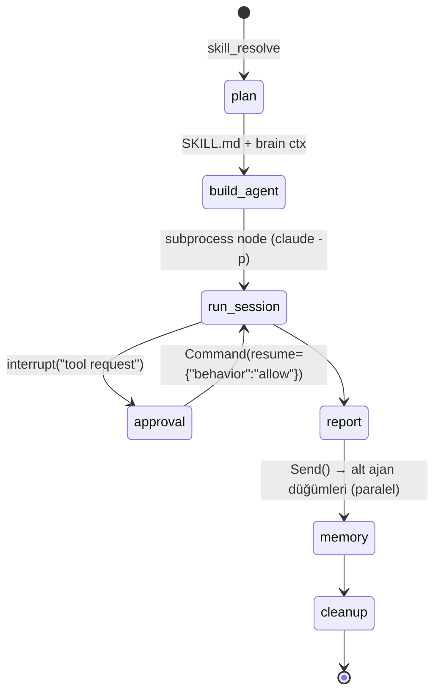
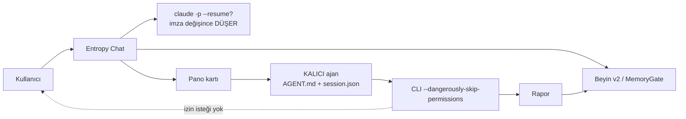
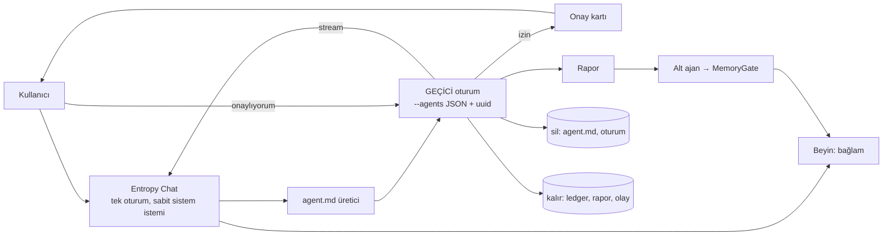

# Araştırma Notu B — İstenen mimari: yetenek başına geçici ajan oturumu, sohbet sürekliliği, gerçek onay, yeni düzen

- **Tarih:** 2026-09-11
- **Depo:** `C:\EntropiAI`, HEAD `b2f12b0` = **v0.11.0**, dal `ai/v0.1.7`
- **Kip:** SALT OKUNUR. Kaynak/test/kasa/ayar değiştirilmedi. **Gerçek model çağrısı yok** —
  yalnız `claude --help/--version`, `agy --help/--version`, `agy models`, `claude agents --help`
  koştu (kota **0 token**).
- **Okunan iç kaynaklar:** `docs/ARCHITECTURE.md` (592 satır), `docs/STATE.md` §1–§2.13,
  `docs/reports/2026-09-11_Arastirma_LangChain_LangGraph_LangSmith.md`,
  ADR-0003 / ADR-0007 / ADR-0009 (başlık ve hükümleri ARCHITECTURE üzerinden doğrulandı).
- **Ölçülen ikililer:** `claude` **2.1.268 (Claude Code)**, `agy` **1.2.0**.

---

## 1. Üç cümlelik özet

Kullanıcının istediği altı adımlı döngünün (SKILL.md → `agent.md` → geçici oturum → canlı
akış → rapor → kendini silme) **beş adımı için gereken CLI yeteneği bugün kurulu ikililerde
mevcut ve ölçüldü**; eksik olan tek şey uygulama tarafındaki *geçici ajan üreticisi* ve
`--permission-prompt-tool` ile kurulacak *uygulama içi onay yüzeyi*dir — kod tarafında bu
bayrak **hiç kullanılmıyor** (`grep -rn "permission.prompt.tool" src tests` → **0 eşleşme**),
onun yerine kart koşusunda `--dangerously-skip-permissions` veriliyor
(`src/entropy/core/claude_bridge.py:802`, çağrısı `:2179`). Sohbetin "önceki mesajı
hatırlamaması" bir kayıp değil bir **mekanizma çakışmasıdır**: saf kipte sistem istemi her
turun bilişsel bağlamını içeriyor, `_forget_stale_session()` imza değişince oturumu düşürüyor
(`claude_bridge.py:1518-1546`, `1769-1770`), geriye yalnız **son 6 mesajın 100 karaktere
kırpılmış** özeti kalıyor (`claude_bridge.py:1671-1680`) — "onaylıyorum" dendiğinde neyin
onaylandığının bilinmemesinin ölçülebilir sebebi tam olarak budur. LangGraph için karar
kesinleşti ve **"ince kabul" seçeneği fiilen yoktur**: `langgraph 1.2.11` zorunlu olarak
`langchain-core<2,>=1.4.7`'e, o da zorunlu olarak `langsmith<1.0.0,>=0.3.45`'e bağlıdır
(PyPI meta verisi, 2026-09-11) — yani LangChain'siz LangGraph diye bir kurulum yok.

---

## 2. CLI yetenek tablosu (kanıtlı)

### 2.1 Ölçüm yöntemi

```
$ claude --version   → 2.1.268 (Claude Code)
$ agy --version      → 1.2.0
$ claude --help      → 260+ satır bayrak listesi (aşağıdaki alıntılar buradan)
$ agy --help         → 22 bayrak + 13 alt komut (tam liste aşağıda)
```

`claude --help` **bilinmeyen bayrakla birlikte de exit 0 verip yardımı basıyor**
(`claude --definitely-not-a-flag zzz --help` → exit 0), bu yüzden "bayrak var mı" sorusu
`--help` denemesiyle **doğrulanamaz**; aşağıdaki "var" hükümleri ya yardım metninde geçen
satıra ya da resmî belgeye dayanır.

### 2.2 Claude Code 2.1.268 — istenen döngü için kritik bayraklar

| Yetenek | Bayrak | Kanıt | Notu |
|---|---|---|---|
| Etkileşimsiz tek tur | `-p/--print` | `--help`: "Print response and exit" | Bugün kullanılıyor (`claude_bridge.py:706`) |
| **Oturum kimliğini önceden atama** | `--session-id <uuid>` | `--help`: "Use a specific session ID for the conversation (must be a valid UUID)" | Kullanılıyor (`:822`); aynı id ikinci kez verilirse CLI `Session ID is already in use` der (ARCHITECTURE §6.1.1) |
| **Oturumu sürdürme** | `-r/--resume [value]`, `-c/--continue` | `--help` + [cli-reference] | Kullanılıyor (`:814`, `:816`). `--print` ile birlikte çalışır |
| Sürdürürken çatallama | `--fork-session` | `--help`: "When resuming, create a new session ID instead of reusing the original" | **Kodda kullanılmıyor** — geçici ajan için ideal: ana sohbetin bağlamını alıp ayrı kimlikte devam |
| Oturumu diske yazmama | `--no-session-persistence` | `--help` (yalnız `--print`) | **Kendini silen ajan için doğrudan karşılık**: oturum dosyası hiç oluşmaz |
| **Dinamik alt ajan tanımı** | `--agents <json>` | `--help`: `'{"reviewer": {"description": "...", "prompt": "..."}}'` | Kullanılıyor (`:799`, `entropy_agents_json` `:855`). Belge: v2.1.242+, başlangıçta doğrulanır |
| Tek ajan seçimi | `--agent <ad>` | `--help` | Kullanılıyor (`:742`) |
| Alt ajanlara ek istem | `--append-subagent-system-prompt[-file]` | resmî cli-reference (v2.1.205+/v2.1.261+) | **Kullanılmıyor**; geçici ajanın kurallarını alt ajanlarına da geçirmenin yolu |
| Sistem istemini **değiştirme** | `--system-prompt`, `--system-prompt-file` | `--help` `--bare` açıklaması: "`--system-prompt[-file]`, `--append-system-prompt[-file]`" + cli-reference | `-file` biçimi ana listede **yok ama gerçek**; kod zaten kullanıyor (`:144`, `:753-756`) |
| Sistem istemine ekleme | `--append-system-prompt[-file]` | aynı | `:134`, `:778` |
| **İstem anlık görüntüsü** | `--system-prompt-snapshot <on\|off>` | `--help`: "on (the default): the prompt is rendered on the conversation's first request … every later request and resume sends the record as-is" | **Sohbet sürekliliği sorununun kalbi** — §4.2 |
| Araç kısıtı | `--tools`, `--allowedTools`, `--disallowedTools` | `--help` | `:790`, `:797` |
| İzin kipi | `--permission-mode` (`acceptEdits, auto, bypassPermissions, manual, dontAsk, plan`) | `--help` | `:709`. Not: bu sürümde seçenek listesinde `default` **yok**, yerine `manual`/`auto`/`dontAsk` var |
| **İzni bir MCP aracına yönlendirme** | `--permission-prompt-tool <mcp_tool>` | ana listede **yok**; `--permission-prompts` açıklamasında geçiyor: *"host (the SDK host or --permission-prompt-tool)"*; resmî cli-reference: "Specify MCP tool to handle permission prompts in non-interactive mode. Claude waits for tool connection (up to 30s timeout)" | **Kodda 0 kullanım.** İstenen "gerçek onay"ın tek CLI yolu |
| İzni kimse yanıtlamasın | `--permission-prompts none` (v2.1.259+) | `--help` | Onay yüzeyi hazır değilken güvenli varsayılan |
| İzinleri atlama | `--dangerously-skip-permissions` | `--help` | **Bugün kart koşusunda açık** (`:802` ← `:2179`) |
| Akış | `--output-format stream-json` + `--verbose` | `--help` | `:707-708` |
| Kısmi/alt ajan/kanca olayları | `--include-partial-messages`, `--forward-subagent-text`, `--include-hook-events` | `--help` | **Kullanılmıyor**; "ajan şu an şunu yapıyor" satırlarının çözünürlüğünü artırır |
| Yapılandırılmış çıktı | `--json-schema` | `--help` | Rapor künyesini şemayla zorlamak için |
| **Tur tavanı** | `--max-turns` | `claude --help \| grep max-turns` → **eşleşme yok**; resmî cli-reference'ta **var** | Kod bunu zaten biliyor: `CLAUDE_SUPPORTS_MAX_TURNS = False` (`claude_bridge.py:101`). Yaptırım `consume_stream` sayacında |
| Bütçe tavanı | `--max-budget-usd` | `--help` (yalnız `--print`) | Abonelik kipinde anlamı **doğrulanamadı** (§8) |
| Model / yedek / efor | `--model`, `--fallback-model`, `--effort (low\|medium\|high\|xhigh\|max)` | `--help` | `:713`, `:718`, `:836` |
| İzolasyon | `--setting-sources ""`, `--strict-mcp-config`, `--mcp-config`, `--add-dir`, `--disable-slash-commands` | `--help` | `:786-795` |
| Kancalar | `--include-hook-events` + `.claude/settings` kanca tanımları | `--help` | Saf kipte `--setting-sources ""` verildiği için kancalar **gelmez**; kanca istenirse `--settings <json>` ile açıkça verilmeli |
| Arka plan oturumu | `--bg`, `claude agents --json` | `claude agents --help` | ADR-0009 ile arşivlenen kalıcı terminal spike'ının konusu; **geçici ajan için gerekmiyor** |

### 2.3 agy 1.2.0 — tam bayrak yüzeyi (`agy --help` çıktısının tamamı sayıldı: 22 bayrak)

`--add-dir, --agent, -c, --continue, --conversation, --dangerously-skip-permissions,
--disable-slash-commands, --effort, -i, --input-format, --json-schema, --log-file, --mode,
--model, --new-project, --output-format, -p, --print, --print-timeout, --project,
--prompt, --prompt-interactive, --sandbox`
Alt komutlar: `agent(s), changelog, help, install, mcp, mic-serve, models, plugin(s),
remote-control, update`.

`agy models` → 15 model (ör. `gemini-3.8-flash-high`, `claude-sonnet-4-6`,
`gpt-oss-120b-medium`); efor **ayrı bayrak olarak da var** (`--effort low|medium|high`)
ama kodda model varyantı olarak geçiriliyor (ARCHITECTURE §4.2).
`agy agents` bu depoda **boş çıktı** verdi (proje kökünde `.agents/agents` derlemesi yok).

### 2.4 Fark tablosu — hangi yetenek hangisinde yok

| Yetenek | claude 2.1.268 | agy 1.2.0 | Döngü için sonucu |
|---|---|---|---|
| Oturum kimliğini **önceden atama** | **VAR** (`--session-id <uuid>`) | **YOK** (`--conversation <id>` yalnız *var olanı* sürdürür) | agy'de kimlik ancak ilk turun çıktısından öğrenilir → `AgentSessionStore` iki yolu ayrı tutuyor (`run_kwargs()`: `session_id` vs `conversation_id`) |
| Sürdürme | `--resume`, `--continue`, `--fork-session` | `--conversation`, `-c/--continue`; **çatallama YOK** | Geçici ajanı ana sohbetten çatallama yalnız claude'da |
| Oturumu diske yazmama | `--no-session-persistence` | **YOK** | "Kendini silme" agy'de dosya temizliğiyle yapılmalı |
| Dinamik alt ajan (JSON) | `--agents <json>` | **YOK** — yalnız `.agents/agents/<ad>/agent.md` dosyası + `--agent <ad>` | agy'de geçici ajan **dosya yazmadan** doğamaz → `agent.md` üret-koş-sil zorunlu |
| Sistem istemi bayrağı | 4 biçim (`--system-prompt[-file]`, `--append-system-prompt[-file]`) | **HİÇ YOK** | agy'de kimlik ancak `agent.md` gövdesinden ya da istemin içinden verilebilir |
| Araç izin listesi | `--tools/--allowedTools/--disallowedTools` | **YOK** | agy'de araç kısıtı yapılamaz |
| İzin kipi | 7 kip | 2 kip (`--mode accept-edits\|plan`) + `--sandbox` | agy'de "plan" ve "accept-edits" dışında granülerlik yok |
| **İzni uygulamaya yönlendirme** | `--permission-prompt-tool` (MCP) | **YOK** | **Gerçek onay yalnız claude yolunda kurulabilir**; agy için tek seçenek `--mode plan` + Entropy'nin kendi komut kapısı |
| Ayar/MCP izolasyonu | `--setting-sources ""`, `--strict-mcp-config` | **YOK** (ARCHITECTURE §4.2'de kayıtlı sınır) | Geçici ajan agy ile koşarsa kullanıcının ayarları sızar |
| stream-json | VAR (+ partial/subagent/hook olayları) | VAR (`--output-format stream-json`, `--input-format stream-json`) | Canlı akış iki tarafta da mümkün; olay çözünürlüğü claude'da yüksek |
| Yapılandırılmış çıktı | `--json-schema` | `--json-schema` (yalnız son sonuç) | Rapor künyesi iki tarafta da şemalanabilir |
| Tur tavanı | bayrak **bu ikilide yok** (belgede var) | **YOK** | İki tarafta da yaptırım Entropy'nin sayacında kalır |
| Maliyet tavanı | `--max-budget-usd` | **YOK** | — |

---

## 3. İstenen döngünün tasarımı

### 3.1 Harita

```mermaid
flowchart TD
    U[Kullanıcı: "media-agency-soldier ile canivopets.com'u sıfırdan araştır"] --> R{Yetenek çözümleme<br/>skills/manager.rank_skills_for_prompt}
    R -->|SKILL.md| G[1. agent.md üretici<br/>scripts: skill_to_agent.py<br/>SKILL.md + beyin bağlamı<br/>+ kabul ölçütü + rapor şablonu]
    G --> S[2. Geçici oturum<br/>claude -p --agents JSON<br/>--session-id UUID --tools ...<br/>--permission-prompt-tool mcp__entropy__ask<br/>--no-session-persistence]
    S -->|stream-json| L[3. Köprü: olay eşleme<br/>provider._agent_stream_emitter<br/>bus.agent_stream]
    L --> C[Sohbet satırı:<br/>"Ajan: web araması yapıyor"]
    S -->|izin isteği| P[4. Onay kartı<br/>bekleyen işler kuyruğu<br/>ne / komut / risk]
    P -->|"onaylıyorum"| S
    S --> Rep[5. Rapor dosyası<br/>Entropy/Reports/<br/>report_title.derive_report_title]
    Rep --> M[6a. Hafıza yazımı<br/>ALT AJAN → MemoryGate.admit<br/>brain/gate.py]
    Rep --> N[6b. Bildirim<br/>bus.task_notification]
    S --> D[7. Kendini silme<br/>agent.md + tmp dizin + oturum sil<br/>ledger satırı KALIR]
```

### 3.2 Adım adım sözleşme önerisi

**Adım 1 — `agent.md` üretimi (küçük Python betiği, kullanıcının istediği gibi).**
Girdi: `SkillDefinition` (`skills/manager.py:200`), kullanıcı istemi, `AssembledContext`
(`brain/context_builder.py`, bütçe 4000 token). Çıktı **iki biçimde**:
- claude: `--agents '{"<slug>": {"description": ..., "prompt": ..., "tools": [...], "model": ...}}'`
  → **dosya yazılmaz**, argv'de taşınır (silinecek bir şey kalmaz);
- agy: `<geçici kök>/.agents/agents/<slug>/agent.md` → koşu sonunda **dizin silinir**.
Gövde şablonu: `## Görev / ## Kabul ölçütleri / ## Rapor şablonu / ## Yasaklar`.
`report_title.derive_report_title` sözleşmesi gereği rapor şablonunun ilk satırı `# H1`
olmalı; aksi hâlde başlık istemden türer ve ARCHITECTURE §6.3'teki hata geri gelir.

**Adım 2 — oturum açma.** Her yetenek koşusu **yeni bir uuid4** alır; `AgentSessionStore`'a
**yazılmaz** (kalıcı ajan yok). `--no-session-persistence` ile CLI tarafında da iz kalmaz.
Efor/model: kartın/ajanın değeri > oturum eforu (mevcut öncelik zinciri `claude_bridge.py:1820-1836`).

**Adım 3 — canlı akış.** Mevcut `provider._agent_stream_emitter` (`core/provider.py:668`,
`:315`) zaten `bus.agent_stream` yayıyor; yeni iş yalnız **sohbette görünür satır**
üretmektir ("ajan şunu yapıyor"). `--include-partial-messages` ve `--forward-subagent-text`
açılırsa çözünürlük artar; **kota maliyeti yok** (aynı turun çıktısı).

**Adım 4 — gerçek onay (uygulama içi).** `--permission-prompt-tool mcp__entropy__ask`
verilir; Entropy kendi **stdio MCP sunucusunu** ayrı bir Python süreci olarak açar
(`platform/proc.popen_kwargs` zorunlu — ARCHITECTURE §4.3), `--mcp-config` ile tanıtır,
`--strict-mcp-config` ile yalnız onu bırakır. Araç çağrıldığında sunucu isteği
uygulamaya iletir (yerel soket/dosya kuyruğu), uygulama **bekleyen işler** kuyruğuna bir
kart koyar (ne isteniyor / hangi araç / hangi komut / risk), kullanıcı "onaylıyorum"
dediğinde araç yanıt döner ve CLI tool'u koşar. **Kritik ayrıntı:** belge
"Claude waits for tool connection (up to 30s timeout)" diyor — yani MCP sunucusu
**CLI'dan önce** ayakta olmalı; onay için kullanıcıyı beklemek ise araç çağrısının
kendi süresidir, 30 sn bağlantı zaman aşımı değildir (**doğrulanamadı**, §8).
Yanıt şemasında `behavior: "allow" | "deny"`, `updatedInput`, `message` alanları
Agent SDK `canUseTool` sözleşmesiyle aynıdır (SDK permissions belgesi, 2026-09-11);
CLI'ın MCP aracı için **birebir JSON şeması resmî belgede yayımlanmamıştır** (§8).
**Uyarı (ölçülü):** `--dangerously-skip-permissions` (`:2179`) açıkken
`--permission-prompt-tool` hiç çağrılmaz; onay yüzeyi açılırken o satır **koşullu**
hâle gelmeli, yoksa "onay kartı hiç çıkmıyor" hatası doğar.

**Adım 5 — rapor.** Dosya `Entropy/Reports/`; sohbete `report_chat_card` ile bildirim.
Mevcut `report_watcher` → `distiller` hattı korunur.

**Adım 6 — hafıza yazımı alt ajanın işi.** Entropy **yazmaz**; ikinci, çok kısa bir
oturum (ya da aynı oturumun son turu) raporu okuyup `MemoryGate.admit(category, content,
importance, metadata, provenance)` çağıracak JSON'u üretir; Entropy yalnız kapıdan geçirir.
Kategori kapalı kümesi `("working","episodic","semantic","procedural")` + `is_identity`
bayrağı (ARCHITECTURE §5.1) değişmez.

**Adım 7 — kendini silme.** Silinenler: geçici `agent.md`/dizini, sistem istemi dosyası
(`write_system_prompt_file` çıktısı), varsa oturum dosyası. **Silinmeyenler:** ledger satırı
(`core/task_ledger.py`), rapor, olay günlüğü satırları, hafıza düğümü. Yani "ajan yok oldu,
ne yaptığı duruyor".

### 3.3 Sohbet sürekliliği — iki seçenek ve önerilen

| Seçenek | Nasıl | Artı | Eksi |
|---|---|---|---|
| **A. Tek `--session-id` + `--resume` zinciri** (önerilen) | Sohbetin kimliği bir kez atanır; **sistem istemi turdan tura DEĞİŞMEZ** (yalnız kimlik + araç sözleşmesi); o turun bilişsel bağlamı **kullanıcı mesajının başına** blok olarak konur (`build_system_context_block` zaten var, `:758`) | `--system-prompt-snapshot on` ile çakışma biter; `_forget_stale_session` bir daha tetiklenmez; "onaylıyorum" aynı konuşmada çözülür; önbellek isabeti artar | Bağlam sistem isteminden kullanıcı mesajına indiği için ağırlığı bir tık düşer (resmî belge bu ödünü açıkça yazıyor) |
| B. Son N tur + özet | Bugünkü yol, ama N=6/100 karakter yerine N=12 + tam metin + `--fork-session` | CLI oturumuna bağımlı değil | Her tur istemi büyütür; kota artar; hâlâ imza değişimiyle oturum düşer |

**Ölçülen gerekçe:** bugün `system_prompt = identity_prompt + context_prompt`
(`claude_bridge.py:1760-1763`) ve `context_prompt` sorguya göre değişen recall içeriyor →
`prompt_signature` (`identity.py:499`) hemen hemen her turda değişir →
`_forget_stale_session` `current_session_id = None` yapar (`:1536`) → `--resume` düşer →
geriye `conversation_history[-6:]` ve `[:100]` kırpması kalır (`:1671-1680`).

---

## 4. Yeni arayüz düzeni (spec, ölçülü)

Bugün (`ui/modes/zen_mode.py`): üst çubuk + **dikey NavList** (7 bölüm: Raporlar & Notlar,
Yetenekler, Görevler, MCP Sunucuları, Ajanlar, Bugün, Bildirimler — `:329-393`), sağda
**bilgi grafiği** (`top_h_splitter.setSizes([880, 400])`, `:418`), altta sohbet
(`main_v_splitter.setSizes([520, 340])`, `:543`).

İstenen:

```
┌───────────────────────────────────────────────────────────────────────────┐
│ [marka] [model kapsülü]   [◱Raporlar][◇Yetenekler][☑Görevler][⌁MCP]        │  h = 48 px
│                           [☺Ajanlar][◷Bugün][◔Bildirimler]   [⌘ palet]     │
├──────────────────────────────────────────────┬────────────────────────────┤
│ İÇERİK ALANI                                 │ [ Sohbet │ Hafıza ]        │  sekme h = 32
│ (seçili düğmenin paneli — QStackedWidget)    ├────────────────────────────┤
│                                              │  çekirdek görseli  136 px  │
│ min 560 px (G13-4 okuyucu kapısı)            ├────────────────────────────┤
│                                              │  akış / mesajlar (esner)   │
│                                              ├────────────────────────────┤
│                                              │  giriş + Gönder   h = 72   │
├──────────────────────────────────────────────┴────────────────────────────┤
│ durum satırı: sağlayıcı · token · pano · bekleyen onay ●n     h = 24 px    │
└───────────────────────────────────────────────────────────────────────────┘
```

| Ölçüt | Değer | Gerekçe / kapı |
|---|---|---|
| Üst şerit yüksekliği | 48 px; düğme 32×32 ikon + 11 px etiket | `ui-design` §0: metni kaldıran sadeleştirme ikon **+ erişilebilir ad** koymak zorunda |
| Üst çubuk öğe sayısı kapısı | mevcut kapı **≤ 4 öğe** (`header_items`) | 7 düğme **ayrı bir `navStrip` grubu** olarak sayılmalı; aksi hâlde kapı kırılır → kapı metni güncellenir, gevşetilmez |
| İçerik alanı | min **560 px** | G13-4 `reader_min_width` ≥ 560 ve "beyan ≥ hesaplanan" |
| Sağ panel | varsayılan **420 px**, min **320 px**, tam yükseklik | bugünkü graf paneli min 260 px; sohbet kutusu 320'nin altında giriş+gönder taşıyor |
| Sekmeler | `Sohbet` (varsayılan) / `Hafıza`; `NavList` değil `QTabWidget` benzeri iki sekme | Hafıza sekmesi bugünkü `KnowledgeGraphWidget` + `memory_inspector` girişini taşır |
| Çekirdek görseli | **≥ 48 px**, ölçülen bugünkü 136×136 korunur, sohbet sekmesinin üstünde | ARCHITECTURE §8 "korunan kimlik öğeleri"; sözleşme testi `tests/ui/test_phase13_ux.py` |
| Marka + model kapsülü | üst şeritte kalır | aynı sözleşme |
| Asgari pencere | 1100×700 (Desk'te ölçülen sığma değeri) | 13-C gerçek ekran ölçümü |
| Yoğunluk | üst şerit 7 düğme + 2 kimlik öğesi + palet = **10 etkileşimli öğe**; boş etkileşimli öğe **0** | G13-1 |
| Zen | yukarıdaki düzenin kendisi | — |
| Chat kipi | üst şerit **3 düğmeye** iner (Sohbet, Bildirimler, palet); sağ panel tüm pencere olur | Chat "sohbet öncelikli" tanımı |
| Floating | yalnız çekirdek + tek satır giriş; düğme yok, palet var | 115 satırlık mevcut kip korunur |

Kalan/gidecek parçalar: `header_bar.py` (326 satır) **kalır**, içine `navStrip` girer;
`nav_list.py` (165 satır) **kalır** ama Zen'de gizlenir (Chat/Floating'de ve dar pencerede
geri düşülür — `QTabWidget` API uyumu bu geçişi ucuz kılıyor); `zen_mode.py`'nin
`top_h_splitter`/`main_v_splitter` kurgusu **tek yatay bölücüye** iner.

---

## 5. LangGraph kararı (kullanıcı ikinci kez sordu)

### 5.1 Döngü LangGraph olarak nasıl yazılırdı


Düğümler: `skill_resolve`, `build_agent`, `run_session` (CLI alt süreci), `approval`
(`interrupt`), `report`, `memory` (`Send` ile fan-out), `cleanup`;
checkpointer `SqliteSaver` (`langgraph-checkpoint-sqlite`).

### 5.2 "İnce kabul" mümkün mü — **ölçüldü, HAYIR**

PyPI meta verisi (2026-09-11, `pypi.org/pypi/<paket>/json`, `requires_dist`):

| Paket | Sürüm | Lisans | Zorunlu bağımlılıkları |
|---|---|---|---|
| `langgraph` | 1.2.11 | MIT | **`langchain-core<2,>=1.4.7`**, `langgraph-checkpoint<5,>=4.1.0`, `langgraph-prebuilt<1.2,>=1.1.0`, `langgraph-sdk<0.5,>=0.4.2`, `pydantic>=2.7.4`, `xxhash>=3.5.0` |
| `langgraph-checkpoint` | 4.2.0 | MIT | `langchain-core>=0.2.38`, `ormsgpack>=1.12.0` |
| `langgraph-checkpoint-sqlite` | 3.1.1 | MIT | `aiosqlite>=0.20`, `langgraph-checkpoint`, `sqlite-vec>=0.1.6` |
| `langgraph-sdk` | 0.4.4 | MIT | `httpx>=0.25.2`, `langchain-core<2,>=1.4.0`, `langchain-protocol>=0.0.15`, `orjson>=3.11.5`, `websockets<17,>=14` |
| `langgraph-prebuilt` | 1.1.0 | MIT | `langchain-core>=1.3.1`, `langgraph-checkpoint` |
| `langchain-core` | 1.6.2 | MIT | httpx, jsonpatch, `langchain-protocol`, **`langsmith<1.0.0,>=0.3.45`**, packaging, pydantic, pyyaml, tenacity, typing-extensions, uuid-utils |

**Sonuç: "yalnız `langgraph` + `langgraph-checkpoint-sqlite`, LangChain yok" diye bir
kurulum yoktur.** Zincir `langgraph → langchain-core → langsmith` **zorunludur**; ayrıca
`langgraph-sdk` üzerinden `websockets` ve `httpx` de gelir. Asgari ağaç
**~18 paket** (bugünkü çalışma zamanı bağımlılığı **5**: PySide6, pydantic, numpy, pypdf,
qtawesome). Yani ince kabul, LangChain araştırma notundaki "5 → 20" ölçümünü
**düşürmez**.

### 5.3 Kazanç / maliyet

| Kazanç | Bizdeki karşılığı | Net |
|---|---|---|
| Checkpointer / yeniden başlatılabilirlik | `brain/checkpoints.py` (445 satır) + `harness` denetim noktası disiplini | Yeni yetenek **yok**; üstelik LangGraph'ınki `ormsgpack` **ikili**, bizimki kasada okunur `.md` |
| `interrupt` = onay bekleme | `board_fsm`: `review → done` yalnız `actor="human"` + kanıt | Genel API bizim **kanıt zorunluluğunu** tipte taşımıyor |
| `Send` = paralel alt ajan | `harness` alt kart üretimi + `entropy_max_parallel=2` | Paralelliğimiz **kota** ile sınırlı, graf genişliğiyle değil |
| İzlenebilirlik | `core/task_ledger.py` (544 satır) + `board_events.jsonl` + `projection_hash` | LangSmith ücretsiz katman 5.000 trace/ay, 1 koltuk; self-host **yalnız Enterprise** |

| Maliyet | Ölçü |
|---|---|
| Bağımlılık | 5 → ~18 paket; `langsmith` istemcisi pakete **zorunlu** girer ("veri yerelde kalır" sözleşmesi ayrı gerekçe ister) |
| PyInstaller | LangChain ailesi `importlib`/entry-point ile dinamik yükler; ARCHITECTURE §2'deki **"spec hiddenimports sessizce eksik paketler"** arıza sınıfına birebir düşer (Faz 10-C emsali) |
| Durum biçimi | msgpack ikili durum ↔ kasa `.md` sözleşmesi |
| İki ajan döngüsü | Araç döngüsü zaten CLI'ın içinde; `ToolNode` ölü ağırlık |

### 5.4 Karar

**A) Desenler alınır, kütüphane alınmaz.** ADR-0003 ("kütüphane değil algoritma") ve
5.2'deki ölçüm bunu zorunlu kılıyor. Alınacak üç desen:
1. **`interrupt`/`Command(resume=...)` sözleşmesi** → bizim "bekleyen işler" kuyruğunun
   şeması (istek id'si, düğüm adı, yeniden girişte aynı noktadan devam);
2. **Süper-adım idempotansı** → her CLI koşusunun `idempotency_key`'i (zaten var) ile
   yeniden oynatmanın **kota harcamaması**;
3. **Durum + kontrol noktası ayrımı** → geçici ajanın durumu bellek değil dosya.

**B) İnce kabul spike'ı — önerilmiyor**, çünkü "ince" seçeneği 5.2'de ölçümle elendi.
Kullanıcı yine de isterse spike adımları (≤ 10k token, izole, **ürüne bağlanmaz**,
ADR-0009 gereği `docs/_archive/spikes/langgraph/` altında doğar):
`scratch/spike_langgraph/` içine ayrı venv → `pip install langgraph langgraph-checkpoint-sqlite`
→ `pip list` ile **gerçek** paket sayısı ölçülür → 7 düğümlü graf sahte CLI düğümüyle yazılır
→ `interrupt` ile onay turu koşturulur → **PyInstaller ile tek dosya derlenir** (asıl risk
burada ölçülür) → rapor: paket sayısı, exe boyut deltası, eksik hiddenimports listesi.
Kabul ölçütü: derlenen exe'de graf import edilebiliyor **ve** paket artışı ≤ 8 ise tartışılır;
aksi hâlde spike kapanır.

---

## 6. Fark analizi (mevcut → istenen)

| Bileşen | Bugün (kanıt) | İstenen | Fark | Ne yapılacak | Risk |
|---|---|---|---|---|---|
| Ajan modeli | **Kalıcı kadro**: kasada `Entropy/Agents/<ad>/AGENT.md`, `compile.py` iki biçime derler, `--agents` ile enjekte (`claude_bridge.py:855`) | Yetenek başına **geçici** ajan, koşu sonunda silinir | Kalıcı roster istenmiyor | `--agents` **koşu başına üretilir**; kasa rosterı **gizlenir** (silinmez: Desk ve pano ona bağlı) | Pano kartı `agent` alanı zorunlu; "ajansız backlog koşmaz" kuralıyla çakışır → geçici ajan adı karta yazılmalı |
| `agent.md` üretimi | **YOK** | SKILL.md + beyin + kabul ölçütü + rapor şablonu | Tam eksik | **Yeni yaz** (küçük saf Python betiği, Qt'siz, testlenebilir) | Rapor şablonunda `# H1` yoksa başlık sözleşmesi kırılır |
| Oturum yönetimi | `AgentSessionStore` kalıcı oturum + imza (`identity.py:499`) | Geçici, tek kullanımlık uuid | Kalıcılık fazlalık | **Yeniden kullan** (aynı `run_kwargs`), ama depoya yazmadan; `--no-session-persistence` eklenir | agy'de `--session-id` yok → kimlik ilk çıktıdan okunur |
| Sohbet sürekliliği | `--resume` var **ama** her tur imza değişince düşüyor (`:1769`); yedek: 6 mesaj × 100 karakter (`:1671`) | İki tur bağlam, "onaylıyorum" çözülür | Mekanizma çakışması | **Düzelt**: sistem istemi sabitlenir, bağlam kullanıcı mesajına iner (§3.3-A) | Bağlamın ağırlığı bir tık düşer; beyin kısa devre sözleşmesi (§5) korunmalı |
| Onay | `--dangerously-skip-permissions` (`:802`←`:2179`); `tool_approval_requested` sinyali **yalnız** `tools/synthesizer.py:115`'te kullanılıyor | Uygulama içi gerçek onay kartı | CLI izin akışı hiç bağlı değil | **Yeni yaz**: stdio MCP onay sunucusu + `--permission-prompt-tool`; skip bayrağı koşullu | MCP bağlantı zaman aşımı (30 sn), şemanın belgesizliği (§8) |
| Bekleyen işler | İki ayrı kuyruk: Desk onayları (`agents/desk_admin.py`, `Entropy/Desk/_pending/`) + sohbet kartları | **Tek** "bekleyen işler" modeli | Parçalı | **Yeniden kullan + birleştir**: `desk_admin` şeması (`id, kind, payload, created_at, source, summary`) araç onayına genişletilir | Tek yön sözleşmesi (Desk → Entropy itemez) bozulmamalı |
| Canlı akış | `bus.agent_stream` + `_agent_stream_emitter` var; sohbette "ajan şunu yapıyor" satırı **yok** | Anlık geri iletim | Görünürlük eksik | **Yeniden kullan**, sohbete render katmanı eklenir | Akış gürültüsü — satır başına kırpma gerekir |
| Rapor | `report_title.derive_report_title` + rapor merkezi + `Sessions/` ayrımı | Aynı | Fark yok | **Koru** | — |
| Hafıza yazımı | `MemoryGate.admit` tek kapı; çağıran çoğunlukla Entropy | Alt ajan işler | Yazar değişir | **Yeniden kullan**, çağrı yeri değişir | Kapı iki kez koşmamalı (`decision=` yolu) |
| Pano FSM | 8 durum / 14 olay / 13 geçiş | Geçici ajan için asgari durum | Aşırı karmaşık | **Gizle**: geçici koşu `running → review → done|failed` üç durumunu kullanır; FSM'e dokunulmaz | FSM'i sadeleştirmek Desk'i kırar — **dokunma** |
| "Oturum yok" rozeti / ajan roster'ı UI | `agent_session_badge.py`, `agents_widget.py` | Kalıcı ajan olmadığı için anlamsız | Ölü yüzey | **Gizle** (Ajanlar düğmesi Desk orkestratörleri + geçici koşu geçmişini gösterir) | — |
| Düzen | NavList solda + graf sağda + sohbet altta | 7 düğme üstte, sağda tam panel | Büyük | **Yeniden yaz** (§4) | Üst çubuk ≤ 4 öğe kapısı; okuyucu ≥ 560 px |
| `platform/proc` | Tüm alt süreçler gizli | MCP sunucusu da gizli olmalı | — | **Yeniden kullan (zorunlu)** | AST kapısı zaten ölçüyor |

### 6.1 İki harita yan yana

**Bugün**


**İstenen**


---

## 7. Faz 14 dilim önerisi

Kabul ölçütü **kullanıcının kendi senaryolarının canlı koşmasıdır**. Kota tahminleri
13-C ölçümünden türetildi (bir kart koşusu **30.839 / 51.860 / 50.843** token; sohbet turu
ölçülemiyor — bu bilinen boşluk STATE §2.13'te kayıtlı).

| # | Dilim | Ajan | Kabul ölçütü (senaryo) | Kota (gerçekçi) | Risk |
|---|---|---|---|---|---|
| **14-A** | Sohbet sürekliliği: sabit sistem istemi + bağlamın kullanıcı mesajına inmesi + `_forget_stale_session` yalnız model/efor değişiminde | agy-integration-engineer | **S1**: iki tur; ikinci turda birinci turun konusu doğru anılır; `--resume` argv'de **görünür** (log kanıtı) | doğrulama 2 tur ≈ **10–15k** | Beyin kısa devre sözleşmesi (ARCHITECTURE §5) bozulmamalı; `[BEYİN]` tonu korunur |
| **14-B** | Onay yüzeyi: stdio MCP onay sunucusu + `--permission-prompt-tool` + skip bayrağının koşullu hâle gelmesi + tek "bekleyen işler" kuyruğu | agy-integration-engineer + ui-engineer | **S2**: "google-flow ile video üret" → araç izni kartı (araç, komut, risk) → "onaylıyorum" → komut koşar; **reddet** yolu da test edilir | 1 canlı koşu ≈ **15–25k** | MCP bağlantı zaman aşımı; Desk onay kuyruğuyla çakışma |
| **14-C** | `agent.md` üretici + geçici oturum + kendini silme + ledger izi | agy-integration-engineer | **S3**: "media-agency-soldier ile canivopets.com'u sıfırdan araştır" → canlı akış satırları → rapor dosyası → bildirim → `agent.md`/oturum **diskte yok**, ledger satırı **var** | 1 araştırma koşusu ≈ **40–60k** | Beyin kısa devresi tazelik ipucuyla zaten kapalı — "sıfırdan" kelimesi `FRESHNESS_HINTS` içinde, iyi |
| **14-D** | Hafıza yazımını alt ajana devretme (MemoryGate çağrısı alt ajanın ürettiği JSON'dan) | memory-rag-engineer | **S4**: 14-C'nin raporundan sonra yeni sohbette Entropy canivopets bulgusunu **kaynaklı** hatırlar; gri bant kuyruğu şişmez | ≈ **10–20k** | Kapının iki kez koşması; kategori disiplini (K7) |
| **14-E** | Yeni düzen (§4) | ui-engineer | **S5**: 7 düğme üstte, sağda tam yükseklik Sohbet/Hafıza sekmesi, çekirdek ≥ 48 px görünür; `ui_audit --gate --final` **exit 0** | 0 (model çağrısı yok) | Üst çubuk ≤ 4 öğe kapısının yeniden yazımı |
| **14-F** | QA + build + kapanış | qa-build-engineer | Tam süit ≥ 2.648 passed / 0 failed, build exit 0, canlı koşum temiz, marka taraması 0 | 0–20k | Kota tavanı (100k) — 13-C'de aşılmıştı |

**Toplam gerçekçi kota: 75–140k.** 13-C'nin dersi gereği canlı doğrulama dilimleri
(14-B, 14-C) **ayrı turlara** bölünmeli; tek turda 100k aşılıyor.

### 7.1 Hafıza sıfırlama gerekir mi — **HAYIR (şimdilik)**

Gerekçe, ölçümle: hafıza şeması Faz 11-B'de zaten temizlendi (1.544 → 669 düğüm, fikstür
531 atıldı), kategori kapalı kümesi ve `provenance` sütunları v2'de yerinde, kör testte
Hit@1 9/10 ve gürültü %0. İstenen değişiklik **yazarı** değiştiriyor (Entropy yerine alt
ajan), **şemayı değil**. Sıfırlama ancak şu ölçüm tetiklenirse gerekir: 14-D sonrası
K3 (gürültü) > %5 **veya** K12 (kaynaksız L2) artıyorsa — o zaman da sıfırlama değil,
`dream.forget_stale` + gri bant turu yeterlidir (`archived=1`, silme yok). Kullanıcı yine
de isterse: `~/.entropy/backups/` altına yedek → `cognitive_memory.db` yeniden kurulur →
`MEMORY.md` ve wiki **korunur** (onlar insan kaynağıdır).

---

## 8. Doğrulanamayanlar

1. **`--permission-prompt-tool`'un MCP araç şeması.** Resmî belge bayrağı tanımlıyor ama
   aracın alacağı **girdi** ve döndüreceği **JSON** için yayımlanmış bir şema bulunamadı;
   Agent SDK `canUseTool` sözleşmesi (`behavior: allow|deny`, `updatedInput`, `message`)
   en yakın birincil kaynak. anthropics/claude-code **#1175** hâlâ "minimal çalışan örnek
   ve belge yok" diyor. **14-B'nin ilk işi bunu canlı ölçmektir.**
2. **30 sn zaman aşımının kapsamı.** "Claude waits for tool connection (up to 30s timeout)"
   cümlesinin *bağlantı* mı yoksa *yanıt* süresi mi olduğu belgeden çıkmıyor. Kullanıcı
   onayı dakikalar sürebilir; ölçülmeden onay yüzeyi tasarımı kilitlenmemeli.
3. **`--max-turns`** kurulu `claude` 2.1.268 `--help` çıktısında **yok**, resmî cli-reference'ta
   **var**. Bayrağın gizli olup olmadığı `--help` ile kanıtlanamadı (bilinmeyen bayrak da
   exit 0 veriyor). Kod zaten `CLAUDE_SUPPORTS_MAX_TURNS = False` diyor; güvenli taraf.
4. **`--max-budget-usd`'nin abonelik kipindeki anlamı** (API dolar harcaması ölçülmediğinde
   ne yaptığı) belgelenmemiş.
5. **agy'nin izin davranışı**: `--mode accept-edits|plan` ve `--sandbox` dışında bir onay
   kancası `--help`'te yok; agy'nin etkileşimsiz kipte izin isteyip istemediği **canlı
   koşulmadan** bilinemez (model çağrısı yasağı nedeniyle koşulmadı).
6. **agy `agent.md` ön bilgisinin tam alan listesi**: `compile.py` başlığı
   `name, description, model, subagent, mainAgent, inheritCustomizations, rules` diyor;
   agy'nin resmî bir şema belgesi bulunamadı, bu liste **bizim kodumuzun iddiası**.
7. **R-13A2-1** (kullanıcının 2 kartının dosyasının bulunamaması) bu notta ele alınmadı,
   STATE'te açık kalıyor.

---

## 9. Karar özeti

| # | Karar | Gerekçe (tek satır) |
|---|---|---|
| K1 | Sohbet sürekliliği **tek oturum + sabit sistem istemi** ile çözülür | `_forget_stale_session` bugün her turda tetikleniyor (`claude_bridge.py:1760-1770`) |
| K2 | Gerçek onay **`--permission-prompt-tool` + stdio MCP** ile kurulur, `--dangerously-skip-permissions` koşullu olur | Başka CLI mekanizması yok; bugün izin akışı hiç bağlı değil |
| K3 | Kalıcı ajan kadrosu **gizlenir, silinmez**; geçici ajan `--agents` JSON'uyla argv'de doğar | Desk ve pano rostera bağlı; argv'de doğan ajan silinecek dosya bırakmaz |
| K4 | Hafızaya **alt ajan** yazar, MemoryGate tek kapı kalır | ARCHITECTURE §5.1 sözleşmesi bozulmadan yazar değişir |
| K5 | **LangGraph alınmaz**; ince kabul ölçümle elendi | `langgraph → langchain-core → langsmith` zorunlu zinciri (PyPI, 2026-09-11) |
| K6 | Pano FSM'ine **dokunulmaz**; geçici koşu 3 durumu kullanır | FSM sadeleştirmesi Desk'i kırar |
| K7 | Hafıza **sıfırlanmaz**; tetik ölçütü K3 > %5 veya K12 artışı | Şema değişmiyor, yalnız yazar değişiyor |

## 10. İş listesi (ajan → iş → kabul ölçütü)

| Ajan | İş | Kabul ölçütü |
|---|---|---|
| agy-integration-engineer | 14-A sohbet sürekliliği; 14-B onay MCP sunucusu; 14-C geçici ajan döngüsü | S1/S2/S3 canlı koşar; argv logları kanıt olarak rapora iliştirilir |
| memory-rag-engineer | 14-D alt ajan hafıza yazımı | S4 canlı; K3/K7/K12 önce-sonra ölçümü tabloda |
| ui-engineer | 14-E düzen; onay kartı ve "ajan şunu yapıyor" satırı | S5; `ui_audit --gate --final` exit 0 |
| repo-curator | üst çubuk kapısının (≤ 4 öğe) yeniden yazımı + ADR-0010 (geçici ajan mimarisi) | ADR yazılı, sözleşme testi güncel |
| qa-build-engineer | 14-F | süit ≥ 2.648 / 0 failed, build exit 0, kota ≤ 100k |

---

## 11. Kaynaklar

**Birincil — resmî belge (2026-09-11'de okundu)**
1. Claude Code CLI reference — https://code.claude.com/docs/en/cli-reference
2. Agent SDK — Configure permissions — https://code.claude.com/docs/en/agent-sdk/permissions
3. Agent SDK — Modifying system prompts — https://code.claude.com/docs/en/agent-sdk/modifying-system-prompts
4. PyPI JSON API `requires_dist` — `langgraph` 1.2.11, `langchain-core` 1.6.2,
   `langgraph-checkpoint` 4.2.0, `langgraph-checkpoint-sqlite` 3.1.1, `langgraph-sdk` 0.4.4,
   `langgraph-prebuilt` 1.1.0 — https://pypi.org/pypi/langgraph/json (ve diğerleri)

**Birincil — yerel ölçüm**
5. `claude --version` → 2.1.268; `claude --help`; `claude agents --help`
6. `agy --version` → 1.2.0; `agy --help`; `agy models` (15 model); `agy help agents`

**Birincil — depo kanıtı**
7. `src/entropy/core/claude_bridge.py:101, 131, 134, 144, 163, 704-840, 855-871, 1518-1546, 1634-1680, 1735-1786, 2160-2195`
8. `src/entropy/core/identity.py:499-511` (`prompt_signature`), `:1206`
9. `src/entropy/core/event_bus.py:65-66`; `src/entropy/tools/synthesizer.py:115-126`
10. `src/entropy/ui/modes/zen_mode.py:279-420, 500-545`; `ui/widgets/{header_bar,nav_list}.py`
11. `src/entropy/agents/compile.py:1-60`; `src/entropy/agents/registry.py:113-190`
12. `src/entropy/skills/manager.py:200-1200`
13. `docs/ARCHITECTURE.md` §2, §4, §5.1, §6.1.1, §6.3, §8, §8.1; `docs/STATE.md` §1, §2.13, §2.14
14. `docs/reports/2026-09-11_Arastirma_LangChain_LangGraph_LangSmith.md` (§2–§4.1)

**İkincil**
15. anthropics/claude-code issue **#1175** — "`--permission-prompt-tool` needs minimal,
    working example and documentation for MCP integration" — https://github.com/anthropics/claude-code/issues/1175
16. anthropics/claude-code issue **#28580** — MCP araçlarının izin davranışı —
    https://github.com/anthropics/claude-code/issues/28580
