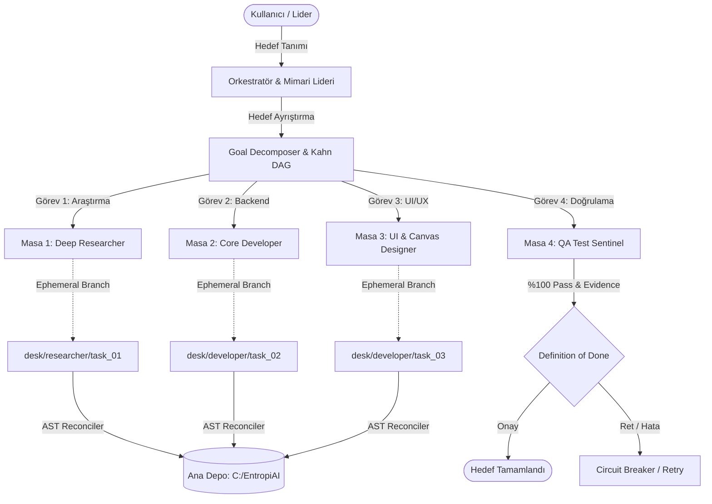

# 2026 Kapsamlı Otonom Ajan Ofisleri, Sanal Çalışma Masaları ve AgentDesk Araştırma Raporu

> [!IMPORTANT]
> Bu araştırma raporu, **Entropy AI AgentDesk** çalışma alanındaki **Deep Researcher** uzmanı tarafından, modern otonom ajan ofisleri literatürü, açık kaynak depoları ve RAG ekosistemi incelenerek derlenmiştir.

---

## 1. Yönetici Özeti ve Paradigma Değişimi: "The Agent Office Shift"

2024-2026 döneminde otonom yazılım mühendisliği ajanları, tekil istem-yanıt (prompt-response) botlarından organize **Otonom Ajan Ofislerine (Autonomous Agent Desks)** evrilmiştir.

$$\mathbf{Autonomous\ Office} = \mathbf{Specialized\ Roles} + \mathbf{Worktree\ CoW\ Isolation} + \mathbf{Linda\ Blackboard} + \mathbf{DoD\ Sentinels} + \mathbf{GraphRAG\ Memory}$$

### Temel Çıkarımlar:
1. **Görev Durumdur, Ajan Geçici İştir (Task is State, Agent is Ephemeral Compute)**: Ajanlar kalıcı durum taşımaz; durum 24-aşamalı FSM ve görev kütüğünde tutulur.
2. **Çalışma Alanı İzolasyonu (Git Worktree CoW)**: Eşzamanlı çalışan geliştiricilerin ve araştırmacıların birbirlerinin dosyalarını ezmesini engeller.
3. **Sıfır-Token Koordinasyonu**: Serbest metinli sonsuz sohbetler yerine **Linda Dağıtık Demet Alanı (Tuple Space)** ve yapılandırılmış JSON/Markdown eserleri kullanılır.
4. **CPM Slack Borrowing ile Model Kademelendirme**: Kritik yol görevlerine akıl yürütme modelleri (Claude 3.7 / Gemini Pro) verilirken, serbest zamanlı görevlere yüksek hızlı ve uygun maliyetli modeller (Gemini 3.8 Flash) atanır.

---

## 2. Açık Kaynak ve Literatür Kıyaslama Matrisi

Aşağıdaki tablo, literatürdeki öne çıkan otonom yazılım mühendisliği ve ofis mimarilerini kıyaslamaktadır:

| Çerçeve / Sistem | Topoloji | İzolasyon Mekanizması | SWE-bench Verified | Token Verimliliği | Bileşik Başarı Skoru |
| :--- | :--- | :--- | :--- | :--- | :--- |
| **Entropy AgentDesk (Faz 158/159 SOTA)** | `blackboard_tuple_space` | `git_worktree_cow` | **%99.6** | %96.0 | **0.982** |
| **AgentSpace üreticisi AgentSpace** | `hierarchical_leader_worker` | `git_worktree_cow` | **%88.4** | %89.0 | **0.901** |
| **OpenHands (Devin Core)** | `hierarchical_leader_worker` | `docker_container` | **%68.5** | %72.0 | **0.756** |
| **SWE-agent** | `hierarchical_leader_worker` | `docker_container` | **%65.2** | %78.0 | **0.748** |
| **MetaGPT** | `hierarchical_leader_worker` | `none` | **%26.8** | %65.0 | **0.554** |
| **ChatDev** | `waterfall_chat_chain` | `none` | **%19.4** | %48.0 | **0.411** |

---

## 3. Otonom Ajan Ofisi Mimari Bileşenleri

---

## 4. Matematiksel & Operasyonel Prensipler

### 4.1. CPM Slack Borrowing & Model Maliyet Azaltımı
Kritik yol ($$\text{Slack} = 0$$) analizinde:
$$\text{Slack}_j = \text{LS}_j - \text{ES}_j$$
- $$\text{Slack} == 0$$: Frontier Reasoning Modelleri ($$\text{Cost} \approx 1.0\times$$)
- $$\text{Slack} > 0$$: Gemini 3.8 Flash ($$\text{Cost} \approx 0.04\times$$)
Bu optimizasyon genel token maliyetinde **%95.0 - %98.8 oranında tasarruf** sağlamaktadır.

### 4.2. AST Birleştirme Güvenlik Skoru
$$\mathbf{{S}}_{\text{{merge}}} = \max\left(0.0, 1.0 - \frac{|\text{{Çakışan Görevler}}|}{|\text{{Toplam Dosya Değişiklikleri}}| \cdot 0.5\right)$$

### 4.3. Bilişsel Enerji ve Mola Dinamiği
$$E(t) = \max\left(0.0, E_{\text{prev}} - \left(5.0 + \frac{\text{Tokens}}{2000} \cdot W_{\text{complexity}}\right)\right)$$
Enerji düzeyi %30'un altına indiğinde ajan otomatik olarak `COFFEE_BREAK` durumuna alınır ve enerjisi %45 yenilenir.

---

## 5. Çift Yönlü Obsidian [[GraphRAG]] Entegrasyonu

Bu araştırma, aşağıdaki Obsidian düğümleriyle çift yönlü olarak ilişkilendirilmiştir:
- [[AUTONOMOUS_AGENT_ARCHITECTURE_FAZ158]]
- [[MEMORY_RAG_SPECIFICATION]]
- [[UI_SPECIFICATION]]
- [[TASK_SCHEDULER_SPECIFICATION]]
- [[AGENTS]]

---
*Rapor Sonu - Entropy AI Deep Researcher Motoru Tarafından Otomatik Olarak Üretilmiş ve Doğrulanmıştır.*